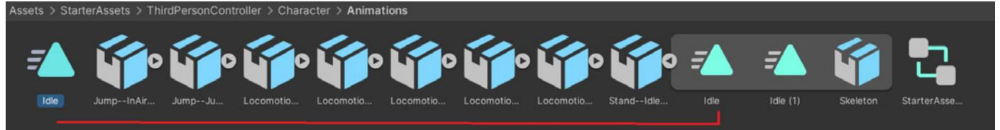
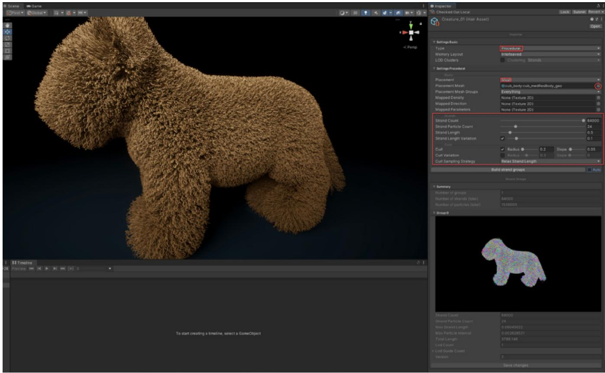

#### **UNITY 2022 LTS EDITION** ⟶ E-BOOK

# The definitive guide to animation in Unity

## **Contents**

| Introduction 5                                 |
|------------------------------------------------|
| Foreword by Dave Hunt 7                        |
| Creating animation for ambitious productions 8 |
| Enabling animators 9                           |
| Unity's animation system 10                    |
| Importing animations into Unity 12             |
| Motion libraries 14                            |
| Exporting animations from Autodesk Maya 16     |
| Exporting animations from Blender 18           |
| Importing animations into Unity 19             |
| Mesh 20                                        |
| Geometry 20                                    |
| Materials 21                                   |
| Skeleton 21                                    |
| Avatar 22                                      |
| Animations 22                                  |
| FBX Import Root object 23                      |
| Generic animation type 24                      |
| Animator Controller 26                         |
| Parameters 28                                  |
| Layers 32                                      |
| Blend Trees 34                                 |
| Character Controller 36                        |

| ¬Animating in Unity 40                          |
|-------------------------------------------------|
| Useful shortcuts for the Animation window 46    |
| Animation Window zoom controls for Windows . 47 |
| Preview vs Recording mode 47                    |
| Setting exact values for keyframes 47           |
| Filter by selection 47                          |
| Animation events48                              |
| Advanced animation features 50                  |
| Events in read-only animations 50               |
| Root motion 51                                  |
| Blend shapes 53                                 |
| Humanoid animation type 55                      |
| Animation Rigging 61                            |
| Set up an IK Rig 63                             |
| Multiple Rigs 66                                |
| Full-body control rig 67                        |
| Foot IK 68                                      |
| Merging IK with animations 70                   |
| Benefits of using animation rigging 71          |
| Timeline for animated cutscenes 72              |
| Animated cutscenes 74                           |
| Adding a Timeline sequence to your scene 74     |
| Adding animation clips 75                       |
| Add track overrides 81                          |
| Keyframing 82                                   |
| Track types 83                                  |
| Activation track 83                             |
| Audio track 83                                  |

| Control track 84                                       |
|--------------------------------------------------------|
| Playables track 85                                     |
| Signal track 85                                        |
| Cinemachine tracks 87                                  |
| Track group 88                                         |
| Sequences 88                                           |
| Advanced simulation 89                                 |
| Rigidbody Physics 89                                   |
| Cloth Physics 95                                       |
| Ragdoll physics 99                                     |
| Fur and hair 102                                       |
| Alembic 104                                            |
| Particles 106                                          |
| AI characters 107                                      |
| Exporting animations 111                               |
| Export FBX models 111                                  |
| Unity Recorder 113                                     |
| 2D Animation 116                                       |
| The PSD workflow 116                                   |
| Rigging in the Sprite Editor 117                       |
| Connecting sprites to bones, geometry, and weights 117 |
| Weights 118                                            |
| Sprite resolvers and 2D IK 119                         |
| Conclusion 120                                         |

## Introduction

A screen shot from the Unity animated short, *Enemies*

Animation is a crucial part of game design, with many games now featuring animated content that's close in visual quality to that of cinematic films.

Animators carry the story of a game forward through characterization and visual storytelling. They are responsible for character rigging, posing, and keyframing animation sequences. As the role of the animator continues to evolve in game development, so do the animation tools and workflows in Unity.

This guide is for both experienced and new animators who are interested in understanding how to use the dedicated animation tools, methods, and techniques available in Unity's animation system.

You'll learn about how to import animations into Unity, the generic and humanoid animation types, animate and rig in the Editor, create animated cutscenes with Timeline, advanced animation options, and more.

Whether you're creating photorealistic scenes, or hand-painted, cell-shaded, or cartoon visuals, Unity can help you bring your animations to life.

An animated character reacting to the environment with runtime rigging

#### Contributors

Pete Jepson is a professional tutor who has taught creative media subjects like film making, animation, photography, graphic design and game design for the past decade. With ten years of experience in Unity, he has multiple design courses on Udemy.com.

Unity Contributors

Dave Hunt is a technical artist for animation and rigging at Unity in Copenhagen. He is passionate about empowering artists and animators with reproducible pipelines and seamless interoperability. He worked in game development for 18 years in the Seattle area before joining Unity in 2017. He contributed to games from the Halo and Destiny series at Bungie as leader of the Rigging Tech Art team, while also teaching part-time in the animation capstone program at the University of Washington.

### Foreword by Dave Hunt

Animation seems to me to be one of the truest forms of creative expression. When something is well animated it can create such a believable illusion of life. In his now-classic book, *Illusion of Life: Disney Animation,* Frank Thomas wrote about how he, Ollie Johnston, and their colleagues in the early years at Disney pioneered and codified the fundamental principles of animation that are still practiced by professional animators today.

I discovered the joy of animation as a kid, with my own stop motion projects of toy robots and figures made of clay and wood. The exhilaration of seeing my ideas come to life drove me to take on more ambitious projects; eventually it led me into the computer animation capstone program at the University of Washington. Little did I know that my choice of study would lead to a meeting with Frank Thomas at his home in Burbank, California, where he personally reviewed my student animation project. I will never forget the youthful glow in his eyes at age 91, while he investigated and articulated just what makes an animated dog seem so much like a real dog. He was constantly observing life and taking note of the beautiful subtleties of how creatures move so that he could integrate them into his animated works.

Since that encounter with a true master, I've felt compelled to share the joy of animation with everyone. I've been lucky to have the opportunity to teach animation in the capstone program at University of Washington for over 15 years, while also working day jobs as an animator and technical artist in game development since 2000. And I think the creative joy that comes from animation is the same, whether you're working at a AAA game studio or on an indie game jam with a small team of friends.

I'm so glad to collaborate with the authors of this e-book and help both newcomers and professionals unlock the doors to animation in Unity, where interactive animation presents great opportunities for creative expression.

I remember well when my best friend Jay and I first downloaded the third-person platformer tutorial with Lerpz the frog character, for Unity 3. We had a book with a chapter that included the few lines of code we needed to take player input and move the character forward while playing the walk animation clip. And with that we were off to create our own stories and worlds and interactive experiences, with only our imagination as limits. We were both veteran animators and game developers at the time yet we still benefited from that brief introduction that helped us to get started in this new context. I hope that you too will find what you need within these pages to bring the tools of Unity animation within your command, and I would be so excited to see what kinds of creative works you can bring to life.

#### Creating animation for ambitious productions

Many games incorporate a rich variety of characters, twists and turns in their storyline, multifaceted environments – all of it often created by an equally diverse team of developers and artists. Such ambitious projects will benefit from a solid animation pipeline that provides content creators with the tools that make sense for the project, enabling them to manage potentially thousands of animations.

The process of moving from character concept to modeling, rigging, and animating is a welltrod sequence for character creation in game development. But it's not perfect and in general, artistic productions are rarely a straightforward process!

For example, a character concept could include legs that are too long to create a naturallooking locomotion cycle, or a composition of the arms and torso that doesn't allow the character to hold their weapon in a realistic way. Ideally, the character creation process should allow for non-destructive iteration on character designs. Dave Hunt and Forrest Söderlind give us a glimpse of how they structured their work in their [GDC 2015 talk](https://www.youtube.com/watch?v=U_4u0kbf-JE). They developed a system that worked well for their large-scale production. This system included using a modular, procedurally-controlled rig building framework in Maya that enabled gameplay, storytelling and worldbuilding to come together efficiently. You can see some of the key steps in their process in the image below. This workflow could be done in Unity as well.

Main stages of character development, as show in the GDC 2015 talk, character images are from the [Unity demo Adam](https://blog.unity.com/games/adam-production-design-for-the-real-time-short-film)

### Enabling animators

In game development it's often the technical artist that enables efficient collaboration between artists, developers, and designers.

Scripting, rigging and technical art are disciplines that can allow a larger production to maintain thousands of files with automated processes.

Here are a few general tips for organizing your animation files, but ultimately every project is unique and the goal should always be to make a pipeline that works for your production.

- **Naming conventions**: Characters are made up of many objects, geometry, bones, and accessories. A good practice is to standardize names so everyone in the team knows how to navigate the hierarchies. Find a good balance between simplicity and readability. Standardized, easy-to-understand naming can also be useful if custom tooling has been created for the animators on your team.
- **Scene organization**: If you are an animator planning to work directly in Unity, consider making a sandbox scene and/or working in prefab mode for common gameplay animations.
- **Asset version tracking and automation:** The [AssetPostprocessor](https://docs.unity3d.com/ScriptReference/AssetPostprocessor.html) class in Unity enables you to run code upon asset import or apply automated import settings with [Presets.](https://docs.unity3d.com/Manual/Presets.html) This can be useful to efficiently verify that assets comply with the team's standards, enabling you to focus more on the actual content creation.

- **Mock up in Unity and use the FBX Exporter:** Designers can mock up animations and cinematic sequences in Unity with systems like [Timeline](https://docs.unity3d.com/Packages/com.unity.timeline@1.8/manual/index.html) that make it efficient to express general intent and timing. Prototyped animations can then be exported via the FBX Exporter to the animator's preferred DCC software for further polishing.
- **Visualizers and custom Editor tools**: Unity offers great flexibility through Editor tooling, allowing you to create custom interfaces for your needs, like visual control rigs, or other tools that make it easier for artists to use many of the animation tools' APIs in Unity.
- **IK in Unity with the Animation Rigging package:** Enabling runtime rigging enables your characters to be in contact with the game world. Sweeping a hand across a surface or gripping and turning a door handle are just a couple of examples of subtle movements that require modifications in the bone chain to make them look realistic. Unity's [Animation Rigging package](https://docs.unity3d.com/Packages/com.unity.animation.rigging@1.3/manual/index.html) will allow you to create these detailed movements, making it a great addition to your character creation process.

#### Unity's animation system

If you are new to Unity, the one of the best sources for learning how to navigate in, and use, the Editor is with Unity Learn tutorials, specifically, the [three Pathways courses](https://learn.unity.com/pathways?utm_source=demand-gen&utm_medium=pdf&utm_campaign=2022-lts&utm_content=the-definitive-guide-to-animation-in-unity): Unity Essentials, Junior Programmer and Creative Core.

The Unity Manual is also an important resource and includes a comprehensive section on [Animation](https://docs.unity3d.com/2022.3/Documentation/Manual/AnimationOverview.html). The following short intro is from the manual.

Unity's animation system provides the following features:

- Easy workflow and setup of animations for all elements of Unity including objects, characters, and properties
- Support for [imported animation clips](https://docs.unity3d.com/2022.3/Documentation/Manual/class-AnimationClip.html) and animation created within Unity
- Humanoid animation [retargeting](https://docs.unity3d.com/2022.3/Documentation/Manual/Retargeting.html)  the ability to apply animations from one character model onto another
- Simplified workflow for aligning animation clips
- Convenient preview of animation clips, transitions and the interactions between them
- Management of complex interactions between animations with a visual programming tool
- Animating different body parts with different logic
- Layering and masking features

The screenshots in this guide are made using the [Universal Render Pipeline](https://docs.unity3d.com/Packages/com.unity.render-pipelines.universal@17.0/manual/index.html) (URP), Unity's multiplatform rendering solution built on top of the Scriptable Render Pipeline (SRP) framework. URP is one of [three render pipelines](https://docs.unity3d.com/Manual/render-pipelines-overview.html?) available in Unity, the other two being the [High Definition Render Pipeline](https://docs.unity3d.com/Packages/com.unity.render-pipelines.high-definition@17.0/manual/index.html) (HDRP) and the Built-In Render Pipeline.

Learn more about URP, HDRP, and Unity toolsets for artists, technical artists, and designers in the following e-books:

[Download](https://unity.com/resources/2d-game-art-animation-lighting-for-artists-ebook?isGated=false)

[Download](https://unity.com/resources/definitive-guide-to-creating-visual-effects?isGated=false)

[Download](https://unity.com/resources/game-designer-playbook?isGated=false)

## Importing animations into Unity

Many studios use software like Autodesk Maya or Blender to create animations that can then be imported into Unity.

Large professional projects often use motion capture, employing actors to perform the motions that will result in realistic movement in the content. Actors wear motion capture suits that have markers spaced across them at key points aligned to a 3D skeleton. High-speed infrared cameras capture the actor's motion, with the data then passed into software like Autodesk MotionBuilder. Face motion is captured in the same way, with markers spread across the actor's face to record realistic facial movement.

After this, you can import the animations into Unity.

Unity's demo team in Stockholm used motion capture to create the animated shorts *[Adam](https://unity.com/demos/adam?utm_source=demand-gen&utm_medium=pdf&utm_campaign=2022-lts&utm_content=the-definitive-guide-to-animation-in-unity)*, *[The Heretic](https://unity.com/the-heretic?utm_source=demand-gen&utm_medium=pdf&utm_campaign=2022-lts&utm_content=the-definitive-guide-to-animation-in-unity)*, and *[Enemies](https://unity.com/demos/enemies?utm_source=demand-gen&utm_medium=pdf&utm_campaign=2022-lts&utm_content=the-definitive-guide-to-animation-in-unity)*.

Realistic human face and body movement in games and other real-time 3D content often relies on motion capture.

In this [blog post,](https://blog.unity.com/games/adam-animation-for-the-real-time-short-film?utm_source=demand-gen&utm_medium=pdf&utm_campaign=2022-lts&utm_content=the-definitive-guide-to-animation-in-unity) animator Krasimir Nechevsky discusses the process of previs, motion capture, and animation for Unity's *Adam*.

A behind-the-scenes shot from the making of the Unity short *[Adam](https://www.youtube.com/watch?v=fA4Ov7Veirk)*

You can also use Unity's [ARKit,](https://docs.unity3d.com/Packages/com.unity.xr.arkit@6.0/manual/) together with an Apple iPhone, to capture facial movements and expressions to control a character's facial rig and mouth movement. See the Unity project [The Realtime Rascals](https://assetstore.unity.com/packages/3d/the-realtime-rascals-191779) for a demonstration of this method.

Live face capture to control a character's face

#### Motion libraries

Adobe Mixamo motion library

If you don't have access to a motion capture suit and motion capture software, you can use premade animated clips from motion capture libraries. These can save you time and be effective for animations on a smaller budget, but you probably won't achieve the same level of fidelity possible with the performance of a real actor.

[Adobe Mixamo](https://www.mixamo.com) and [Reallusion ActorCore](https://actorcore.reallusion.com/) are motion library websites that feature thousands of small motion clips that can be downloaded into your 3D software of choice, including Unity.

In addition to having a range of free characters to choose from, you can upload your own character. If each character has a different skeletal structure the animations that play on one of them might not play on another, unless they are using a humanoid animation type. If you plan to use a humanoid animation type ensure that you download the T pose to begin with, as this is necessary for the humanoid setup (this is covered in a later section of the guide).

| Format              |   | Pose               |          |
|---------------------|---|--------------------|----------|
| FBX for Unity(.fbx) | > | T-pose             |          |
| Frames per Second   |   | Keyframe Reduction |          |
| 30                  | > | none               |          |
|                     |   |                    |          |
| CANCEL              |   |                    | DOWNLOAD |

When you download the models from Mixamo you need to select the FBX for Unity format and T-pose settings.

The [Unity Asset Store](https://assetstore.unity.com/3d/animations?utm_source=demand-gen&utm_medium=pdf&utm_campaign=2022-lts&utm_content=the-definitive-guide-to-animation-in-unity) is a great place to find premade animations. Search the animation category and download packages to Unity through the Package Manager. The animations should be set up automatically and ready to use.

In addition to premade animations you can also download ready-made tools to enhance the quality of your project. Sakura Rabbit, whose character and animation work is seen in the image above, uses Unity Asset Store packages like [Final IK](https://assetstore.unity.com/packages/tools/animation/final-ik-14290), [MagicaCloth,](https://assetstore.unity.com/packages/tools/physics/magica-cloth-160144) and [Face Capture.](https://assetstore.unity.com/packages/3d/characters/animals/the-realtime-rascals-face-capture-character-pack-206987)

#### Work with humanoid animations

This video shows how to import downloaded animations into Unity and set them up as a humanoid animation type using root motion. Other workflows it covers include:

- Modifying animations using animation rigging, including IK.
- Using layers to combine animations.
- Setting up attributes to control animation flow.
- Setting up a character controller.
- Setting up AI characters.

#### Exporting animations from Autodesk Maya

The Maya IK Handle can't be exported from Maya to Unity. Any motions controlled by the Maya rig must be baked to an animation clip before export. Maya does this automatically for you with the [send to Unity](https://help.autodesk.com/view/MAYAUL/2024/ENU/?guid=GUID-01D019BF-4686-469C-98A1-FDA30C75FFAE) option.

However, the automatic export option will make assumptions that might not apply to every situation. Often at large studios, a technical artist will use scripting to create a custom tool for exporting that uses the method best suited to their team.

A rigging setup in Maya from a character created by Sakura Rabbit.

For more detailed control, follow these steps to manually export your character:

- 1. Select the character you want to export.
- 2. In the outliner click on hips to select the root node of the skeleton.
- 3. Go to **Select > Hierarchy** to select all the connected bones.
- 4. While holding Shift, select all the mesh objects for the character.
- 5. Go to **File > Export Selected**. Choose to export as an FBX file.
- 6. In the options you can now choose if you want to export animations. If you leave this unchecked it will export the model only. If your character is in T pose then it will be easier to set up a humanoid animation type in Unity.
- 7. Be sure to select the option to bake the animation if you've opted to export an animation. You can set the start frame and end frame. This bakes all motions to a keyframed animation file that will be exported alongside the 3D mesh.

Baking animations on export in Maya

Selecting the full character in Maya

### Exporting animations from Blender

Follow these steps to export from Blender:

1. Switch off any objects you don't want to export by clicking on the visibility (eye) icon that appears alongside the object. The character you want to export should be the only object still visible.

| 16. 0 L= >         | 7 × 電  |
|-----------------------|--------|
| F Scene Collection |        |
| T Collection          | 7 0 10 |
| 4xxxx2 Armature    | 0 10   |
| Camera -           | U 6    |
| > Sun X               | U 10   |
|                       |        |

Turn off visibility for items you don't want to export

| Operator Presets    |                   | ++                     |
|---------------------|-------------------|------------------------|
| Path Mode           | Auto              |                        |
| Batch Mode          | Off               |                        |
| Include V        |                   |                        |
| Limit to            | Selected Objects  |                        |
|                     | V Visible Objects |                        |
|                     | Active Collection |                        |
| Object Types        | Empty             |                        |
|                     | Camera            |                        |
|                     | Lamp              |                        |
|                     | Armature          |                        |
|                     | Mesh Other     |                        |
|                     |                   |                        |
|                     | Custom Properties |                        |
| Transform           |                   |                        |
| Scale               |                   | 1.00                   |
| Apply Scalings      | All Local         | V                      |
| Forward             | -Z Forward V   |                        |
| Up                  | Y Up              | V                      |
|                     | Apply Unit        |                        |
|                     |                   | Use Space Transform    |
|                     | Apply Transform   | 0                      |
| > Geometry       |                   |                        |
| Armature            |                   |                        |
| Primary Bone Axis   | Y Axis            |                        |
|                     |                   |                        |
| Secondary Bone Axis | X Axis            |                        |
| Armature FBXNode T  | Null              |                        |
|                     | Only Deform Bones |                        |
|                     | Add Leaf Bones    |                        |
| V Bake Animation    |                   |                        |
|                     | V Key All Bones   |                        |
|                     | NLA Strips        |                        |
|                     | All Actions       |                        |
|                     |                   | Force Start/End Keying |
| Sampling Rate       |                   | 1.00                   |
| Simplify            |                   | 1.00                   |
|                     |                   |                        |
| + Export FBX     |                   | Cancel                 |

Blender export options for animated characters

- 2. Select the Armature, but don't select any control rigs as they can't be exported from Blender to Unity.
- 3. Go to **File > Export > FBX.**
- 4. In the FBX export options, choose Visible Only; this ensures the control rig and any other items don't get exported in the file. Select the armature and mesh object types only (hold Shift to select multiple options).
- 5. Under **Armature**, choose **Only Deform Bones** and uncheck **Add Leaf Bones**. The deform bones are the skeletal bones that deform the mesh. If the **Bake Animation** box is unchecked it will export the mesh only. Clicking on Bake Animation will also export the animations that will be baked down to keyframes in animation clips, including any actions that are set by the control rig. Any animation strips in the non-linear editor will be exported as separate embedded animation clips.

## Importing animations into Unity

Animated character imported into Unity

FBX is the preferred format for 3D models that have embedded animations. You can [import](https://docs.unity3d.com/Manual/ImportingModelFiles.html)  [FBX files into Unity](https://docs.unity3d.com/Manual/ImportingModelFiles.html) by dragging them directly from your computer's file browser into the Editor's Project window.

Structure of an FBX file (from Unity's [Starter Assets - ThirdPerson CharacterController](https://assetstore.unity.com/packages/essentials/starter-assets-third-person-character-controller-urp-196526) package)

The FBX file will have a number of embedded components and properties, including mesh, geometry, materials, skeleton, avatar, and animations.

#### **Mesh**

A mesh is 3D model data that defines the shape of an object. In Unity, a [Mesh asset](https://docs.unity3d.com/Manual/class-Mesh.html) holds all the vertices, normals, blend shapes and UV data of a model.

Mesh data for the FBX file

#### **Geometry**

Geometry is the physical model powered by the mesh. This contains a [Skinned Mesh Renderer component](https://docs.unity3d.com/Manual/class-SkinnedMeshRenderer.html) that defines how this looks in the scene and is skinned to the skeleton, so it moves as the bones of the skeleton move. Materials can be assigned to the geometry in the Skinned Mesh Renderer component.

| @ Inspector                     |                             | 0        |  |  |  |
|---------------------------------|-----------------------------|-------------|--|--|--|
| V Armature_Mesh                 |                             | Static      |  |  |  |
| Tag Untagged                    | Layer Default >          | >           |  |  |  |
| 1 Transform                  |                             | 0 2   |  |  |  |
| Position                        | Z × Y 0 0       | 0           |  |  |  |
| Rotation                        | Z × Y 0 O       | 0           |  |  |  |
| 2 Scale                      | Z Y 1 × 1             | 1           |  |  |  |
| Skinned Mesh Renderer           |                             | C 2   |  |  |  |
|                                 | 80 Edit Bounds           |             |  |  |  |
| Bounds                          |                             |             |  |  |  |
| Center                          | X -5.960464€ Y -0.0921425 Z | 0.0262486.  |  |  |  |
| Extent                          | X 0.5281845 Y 0.8809299     | Z 0.2205018 |  |  |  |
| Quality                         | Auto                        | ▶           |  |  |  |
| Update When Offscreen           |                             |             |  |  |  |
| Mesh                            | Armature_Mesh               | O           |  |  |  |
| Root Bone                       | J-Hips (Transform)          | O           |  |  |  |
| V Materials                     |                             | 3           |  |  |  |
| Element O                       | CM_Armature_Body            | O           |  |  |  |
| Element 1                       | CM_Armature_Arms            | O           |  |  |  |
| Element 2                       | CM_Armature_Legs            | 0           |  |  |  |
|                                 |                             | +           |  |  |  |
| V Lighting                      |                             |             |  |  |  |
| Cast Shadows                    | On                          | ▶           |  |  |  |
| Static Shadow Caster            |                             |             |  |  |  |
| Probes                          |                             |             |  |  |  |
| Light Probes Anchor Override | Blend Probes                | > O      |  |  |  |
| Additional Settings             | None (Transform)            |             |  |  |  |
| Skinned Motion Vectors          | >                           |             |  |  |  |
| Dynamic Occlusion               | >                           |             |  |  |  |
| Rendering Layer Mask            | Light Layer default         | ▶           |  |  |  |

Geometry for an FBX file

#### **Materials**

[Materials](https://docs.unity3d.com/Manual/materials-introduction.html) are assets that define how the surface of an object appears when rendered and use a Unity shader to combine textures which are applied to the geometry to define the look of the model in the scene.

Material settings for an FBX file

#### **Skeleton**

The skeleton is a series of bones (at least 15 for a biped character), that are skinned to the mesh to animate the movement of the character in the scene. The skeleton is hidden by default in the scene and game views. You can access it in the Hierarchy. If you want to visualize the skeleton, use the bone renderer explained in the [Animation](https://docs.unity3d.com/Packages/com.unity.animation.rigging@1.3/manual/RiggingWorkflow.html)  [Rigging](https://docs.unity3d.com/Packages/com.unity.animation.rigging@1.3/manual/RiggingWorkflow.html) section later in this e-book.

A skeleton that is used to animate the FBX file

#### **Avatar**

The [avatar](https://docs.unity3d.com/2022.3/Documentation/Manual/class-Avatar.html) defines the bone layout for a character which defines how a character or object can be animated using the Unity Animator system. Generic avatars can be non biped structures suitable for animals and creatures.

Humanoid avatar layout defining the bone names for an FBX file

#### **Animations**

FBX files can store multiple embedded animation clips. Each animation clip stores keyframed motion data that animates the skeleton of the character.

If you export an FBX file without geometry (but with animation) it will contain a skeleton and animation clip, indicated with a triangular icon.

Animation clips embedded in the FBX file

Animation-only FBX file

#### **FBX Import Root object**

The FBX Import Root object is the main FBX object that contains the settings for the FBX file.

Import settings for the FBX file

#### More resources from the Unity Manual:

- [Model tab](https://docs.unity3d.com/Manual/FBXImporter-Model.html)
- [Rig tab](https://docs.unity3d.com/Manual/FBXImporter-Rig.html)
- [Animation tab](https://docs.unity3d.com/Manual/class-AnimationClip.html)
- [Materials tab](https://docs.unity3d.com/Manual/FBXImporter-Materials.html)

## Generic animation type

Unity uses two main animation types to control character animations, [Generic](https://docs.unity3d.com/Manual/GenericAnimations.html) and [Humanoid](https://docs.unity3d.com/Manual/ConfiguringtheAvatar.html). Humanoid provides a universal structure that can be applied to all biped characters. Generic is specific to each character's skeletal structure. The animation curves are position, rotation, and scale, and normalized muscle space.

| @ Inspector              |       |   |                        |           |        |       |
|--------------------------|-------|---|------------------------|-----------|--------|-------|
| Armature Import Settings |       |   |                        |           |        | -1    |
|                          |       |   |                        |           |        | Open  |
|                          | Model |   | Rig   Animation        | Materials |        |       |
|                          |       |   |                        |           |        |       |
| Animation Type           |       |   | Generic                |           |        |       |
| Avatar Definition        |       |   | Create From This Model |           |        | V     |
| Root node                |       |   | None                   |           |        |       |
| Skin Weights             |       |   | Standard (4 Bones)     |           |        |       |
| Strip Bones              |       | > |                        |           |        |       |
| Optimize Game Objects    |       |   |                        |           |        |       |
|                          |       |   |                        |           | Revert | Apply |

Rig settings for the FBX file

The generic animation type can be used for animators who want to keyframe animations directly inside Unity using forward kinematics (FK), and in cases where it's unnecessary to share animations between characters with different skeletal structures.

If you import your own FBX file it will be set to **Generic** by default. This animation type is unique to that character and its skeletal layout. However, other animations for characters that have a different skeletal setup might not work with this character when using a generic animation type, but generic animations will still work with characters that have the same skeletal layout.

You can change its animation type at any point from the drop-down menu in the Rig tab of the FBX file. You can also create an avatar from this model if it does not already have one. It's best if you can create avatars from models in the T or A pose.

|                        | Materials Model Rig Animation                                                                                                                                                        |                 |
|------------------------|-----------------------------------------------------------------------------------------------------------------------------------------------------------------------------------------------|-----------------|
| Animation Type         | Generic                                                                                                                                                                                       |                 |
| Avatar Definition      | Copy From Other Avatar                                                                                                                                                                        |                 |
| its Avatar definition. | If you have already created an Avatar for another model with a rig identical to this one, you can copy With this option, this model will not create any avatar but only import animations. |                 |
| Source                 | ArmatureAvatar                                                                                                                                                                                | 0               |
| Skin Weights           | Standard (4 Bones)                                                                                                                                                                            |                 |
| Strip Bones            | V                                                                                                                                                                                             |                 |
|                        |                                                                                                                                                                                               | Revert Apply |

Animation-only FBX file rig setup

Animation-only FBX files will also use a generic animation type by default. They will need to reference the avatar from the FBX character file to ensure the animations are matched correctly to that character's skeleton.

You can define animation clips in the **Animation** tab of the FBX import settings by clicking the **+** icon beneath the clips section. Sometimes there are multiple motions within the same clip, in which case it's necessary to separate each one into their own clip. If nothing is defined, the clip is named Take01.

| Clips                                                                     |  | Start | End    |
|---------------------------------------------------------------------------|--|-------|--------|
| Idle                                                                      |  | 1.0   | 149.0  |
| Idle (1)                                                                  |  | 1.0   | 90.0   |
|                                                                           |  | +     |        |
| Idle (1) -A                                                            |  |       | @ :    |
|                                                                           |  |       |        |
| Length 2.967                                                              |  |       | 30 FPS |
| 1 1 1 1 1 1 1 1 1 12:00 1 1 1 12:00 1 1 1 1 12:00 1 1 1 1 14:00 1 1 1 1 1 |  |       |        |
| Start 1                                                                |  | End   | 90     |
| Loop Time                                                                 |  |       |        |

Duplicating and adjusting animation lengths

You can change the timing of the clip by adjusting the in/out markers, or typing a frame number into the **Start** or **End** slot. Click **Apply** to import the animation clips to the character prefab.

You also have the option of setting the clip to loop as well as setting a cycle offset if you find the loop is not seamless. Adjusting that by a few frames can ensure the first and last keyframe of the clip match up.

#### Animator Controller

An [animation state machine](https://docs.unity3d.com/Manual/StateMachineBasics.html) in Unity

An [Animator Controller](https://docs.unity3d.com/2022.3/Documentation/Manual/Animator.html) is responsible for storing and driving all animations for a character. Right-click in the Project tab and create an Animator Controller via **Create > Animator Controller**. The character will need an [Animator component](https://docs.unity3d.com/Manual/class-Animator.html) to hold the Animator Controller.

| ▼ > < Animator          |                                                                                                                                       | 9 - |   |
|-------------------------|---------------------------------------------------------------------------------------------------------------------------------------|-----|---|
| Controller              | Controller                                                                                                                            |     | 0 |
| Avatar                  | ArmatureAvatar                                                                                                                        |     | 0 |
| Apply Root Motion       |                                                                                                                                       |     |   |
| Update Mode             | Normal                                                                                                                                |     | V |
| Culling Mode            | Cull Update Transforms                                                                                                                |     | D |
| Clip Count: 0 (0.0%) | Curves Pos: 0 Quat: 0 Euler: 0 Scale: 0 Muscles: 0 Generic: 0 PPtr: 0 Curves Count: 0 Constant: 0 (0.0%) Dense: 0 (0.0%) Stream: 0 |     |   |

Animator component

A quicker way to achieve this is to drag a clip from the Project view onto the character prefab in the Hierarchy. This adds an Animator component to the character and the animation clip to an Animator Controller.

To access the controller, open the [Animator window](https://docs.unity3d.com/2022.3/Documentation/Manual/AnimatorWindow.html) via **Window >Animations >Animator** or double-click the Animator Controller in the Project view. You can now drag in the animation clips to assign them to the character. Ensure that the animations match the same animation type set for the character: Generic animations for a generic character, and humanoid animations for a humanoid character.

Animator window layout

The orange block seen in the screenshot of the Animator window above, is an [animation state](https://docs.unity3d.com/Manual/class-State.html) **node**. This is the default animation that will play first. Add transitions from one node to the next by right-clicking on a node, choosing **Make Transition**, and moving to the animation node of choice.

In the example above the transitions go from **Idle** to **Walk\_N** and back again, creating a constant loop. The two other nodes for the jump have no direct transition to Idle or Walk\_N, so they will not play. For an animation to be active it needs a transition from any node that is connected to the default state issuing from the orange node, or a transition from the **Any State** node.

Click on a transition line to see the settings for that particular transition including the conditions for when and how the transition happens.

Blend time for the transition between two animations

The small blue section highlighted by the red box in the image above is the blend time between the two animations. The longer the blend, the smoother the transition. This prevents noticeable pops when changing from one animation to the next.

Drag the two blue arrows to extend or shorten the blend time between the two animations.

If you select the option **Has Exit Time**, the first animation will have to play entirely before making the transition to the next. Select this if there are no conditions set.

#### Parameters

The Animator Controller needs to be interactive so the player can drive animations, for example, by pressing certain buttons. To be interactive, the controller needs [parameters.](https://docs.unity3d.com/Manual/AnimationParameters.html) These are variable inputs that can be set as conditions in the animation transitions.

Click the **+** icon to add a Bool to the parameter called Walking. A **Trigger** parameter called **Jump** can also be set.

Creating parameters in the animator window

Now in the transition from Idle to Walk\_N, the **Walking** condition can be set **true**. Deselect the **Has Exit Time** option and the transition happens immediately without having to play the entirety of the Idle animation.

|        | a :            | @ Inspector   |                |                          |                                                       |   | a :       |
|--------|----------------|---------------|----------------|--------------------------|-------------------------------------------------------|---|-----------|
|        | Auto Live Link | ரு            | ldle -> Walk_N |                          |                                                       |   | 과 :       |
|        |                | S             |                | 1 AnimatorTransitionBase |                                                       |   |           |
|        |                | Transitions   |                |                          |                                                       |   | Solo Mute |
| Walk_N |                |               | ldle -> Walk_N |                          |                                                       |   |           |
|        |                |               |                |                          |                                                       |   |           |
|        |                | 3             |                |                          |                                                       |   | 0         |
|        |                |               | ldle -> Walk_N |                          |                                                       |   |           |
|        |                | Has Exit Time |                |                          |                                                       |   |           |
|        |                | > Settings    |                |                          |                                                       |   |           |
|        |                |               |                |                          | >:00  0:10,  0:26   1:10,  1:10,  1:20,  1:20,  1:20, |   |           |
|        |                |               |                |                          |                                                       |   |           |
| ldle   |                |               |                |                          |                                                       |   |           |
|        |                | ldle          |                |                          |                                                       |   |           |
|        |                |               |                | Walk_N                   |                                                       |   |           |
|        |                | Conditions    |                |                          |                                                       |   |           |
|        |                |               | Walking        |                          | · true                                                |   |           |
|        |                |               |                |                          |                                                       | + |           |

A bool condition is set from the walking parameter to control when the transition happens.

For the transition from Walk\_N back to Idle, the **Walking** condition can be set to **false**.

A C# script is needed to control the parameters for the character.

How a script controls the transitions from two nodes in the animator

The script gets the Animator component on the character in order to control it using the *animator = GetComponent<Animator>();* in *Start()*. During the Update method it waits for the player to press the W or Up arrow key (this is vertical input). When this happens the walking bool in the animator is set to **true**. Now the transition from Idle to Walk\_N takes place.

It continues to play the Walk\_N animation as long as the player is pressing up. When the player stops pressing up, the walking bool in the animator is set to **false**. The transition from Walk\_N to Idle takes place and the Idle animation continues to play until the player pushes the Up arrow key again.

The Update method is also waiting for the player to press the jump key (by default this is set to the spacebar). When this happens the animator runs the Jump trigger that plays the jump animation once for every press on the spacebar.

It has two transitions for the jumping animation, from both idle and walking, because you might decide to jump from either state, with the condition of both transitions set to **Jump**.

A trigger parameter condition is set to control when the jump happens from both Walk\_N and Idle.

Another way to achieve this is to have a transition from the **Any State** node. Be aware that this can then be called from any clip in the entire animator. To keep the animation loop active it has a transition back to Idle once completed.

Using the Any State node for transitions from any animation node

You can click on the animation node to adjust the play speed to either slow this down or speed it up. You can also assign certain animations tags in the **Tag** field, which are useful when coding. In the example below, the Walk\_N animation has a motion tag, but the Idle animation has none. This will allow the code to identify when the character is in motion.

Animation state settings including setting tags

Use an [AnimatorStateInfo](https://docs.unity3d.com/ScriptReference/AnimatorStateInfo.html) struct to monitor animations from script. This passes information to the script every frame on the current activity of the animator. In the example below, in the Update method, it gets information from the animator on the base layer, which is layer 0.

If an animation clip with the motion tag plays, it will move the character forward using the transform.Translate command.

Monitoring the animator using code

The AnimatorStateInfo struct can be used to check when animations are playing or transitioning, providing you with a powerful way to time your code with the Animator component.

#### Layers

You can also use [layers](https://docs.unity3d.com/Manual/AnimationLayers.html) to divide up different sets of animations for a character. The different body parts of the character can use different animations, allowing you to combine multiple animations into a new unique animation.

The basic walk animation is on layer 0, called the Base Layer, in the Animator:

Basic walk animation

You can use an [avatar mask](https://docs.unity3d.com/Manual/class-AvatarMask.html) to define which body parts will use the basic walk animation and which will use a different animation. Use them with the layer system to exclude certain body parts affected by specific animations. You can combine motions together, e.g., use the upper body from one and the lower body from another.

To create an avatar mask, right-click in the Project window and choose **Create > Avatar Mask**. In the Inspector you'll see two types to select from depending on the animation type your character is using.

A Humanoid provides you with a visual guide to the character and is only used when your character has a humanoid animation type. Click the body parts in the humanoid section to exclude them (indicated by the parts turning red).

Humanoid avatar mask setup

|                                                                                                                                                                               | Avatar Mask (Avatar Mask)          |                 | 0 元 :      |  |  |  |  |
|-------------------------------------------------------------------------------------------------------------------------------------------------------------------------------|------------------------------------|-----------------|------------|--|--|--|--|
|                                                                                                                                                                               |                                    |                 | Open       |  |  |  |  |
| Humanoid                                                                                                                                                                      |                                    |                 |            |  |  |  |  |
| V Transform                                                                                                                                                                   |                                    |                 |            |  |  |  |  |
|                                                                                                                                                                               | Use skeleton from                  | ArmatureAvatar  | 0          |  |  |  |  |
|                                                                                                                                                                               |                                    | Import skeleton |            |  |  |  |  |
| ಇ                                                                                                                                                                             |                                    |                 |            |  |  |  |  |
|                                                                                                                                                                               | Use   Node Name                    |                 |            |  |  |  |  |
| >                                                                                                                                                                             | Geometry                           |                 |            |  |  |  |  |
| >                                                                                                                                                                             | Armature_Mesh                      |                 |            |  |  |  |  |
| >                                                                                                                                                                             | v Skeleton                         |                 |            |  |  |  |  |
|                                                                                                                                                                               | V Hips                             |                 |            |  |  |  |  |
|                                                                                                                                                                               | v Left_UpperLeg                    |                 |            |  |  |  |  |
|                                                                                                                                                                               | ▼ Left_LowerLeg                    |                 |            |  |  |  |  |
|                                                                                                                                                                               | v Left Foot                        |                 |            |  |  |  |  |
|                                                                                                                                                                               | T Left_Toes Left_ToesEnd        |                 |            |  |  |  |  |
|                                                                                                                                                                               | T Right_UpperLeg                   |                 |            |  |  |  |  |
|                                                                                                                                                                               | Right_LowerLeg                     |                 |            |  |  |  |  |
|                                                                                                                                                                               | ▼ Right Foot                       |                 |            |  |  |  |  |
|                                                                                                                                                                               | v Right_Toes                       |                 |            |  |  |  |  |
|                                                                                                                                                                               | Right_ToesEnd                      |                 |            |  |  |  |  |
|                                                                                                                                                                               | V Spine                            |                 |            |  |  |  |  |
|                                                                                                                                                                               | v Chest                            |                 |            |  |  |  |  |
|                                                                                                                                                                               | V UpperChest                       |                 |            |  |  |  |  |
|                                                                                                                                                                               | v Left_Shoulder                    |                 |            |  |  |  |  |
|                                                                                                                                                                               | ▼ Left_UpperArm                    |                 |            |  |  |  |  |
|                                                                                                                                                                               | V Left_LowerArm                    |                 |            |  |  |  |  |
|                                                                                                                                                                               | > Left Hand                        |                 |            |  |  |  |  |
|                                                                                                                                                                               | > Neck                             |                 |            |  |  |  |  |
|                                                                                                                                                                               | v Right_Shoulder                   |                 |            |  |  |  |  |
|                                                                                                                                                                               | V Right_UpperArm Right LowerArm |                 |            |  |  |  |  |
| 4 4 8 8 8 8 8 7 7 7 7 7 7 7 7 7 7 7 7 7 7 7 7 7 7 7 7 7 7 7 7 7 7 7 7 7 7 7 7 7 7 7 7 7 7 7 7 7 7 7 7 7 7 7 7 7 7 7 7 7 7 7 7 7 7 7 7 7 7 7 7 7 7 7 7 7 7 7 7 7 7 7 7 7 7 7 7 | > Right Hand                       |                 |            |  |  |  |  |
|                                                                                                                                                                               | Toggle All                         | Collapse All    | Expand All |  |  |  |  |
|                                                                                                                                                                               |                                    |                 |            |  |  |  |  |

The Transform section provides you with a tree layout of the character's skeletal structure and is used with a generic animation type. It requires you to add the character's avatar and load the skeleton from that avatar.

You can expand the tree to show all bones and then use the toggle button to switch them on or off. Select items to set them to override the base animation. Unselected items are excluded, meaning the base animation will be used on those bones.

Only the character's arms are selected in the example above, so a new animation will drive the arms, while the base animation drives the rest of the character.

Generic Avatar Mask setup

A new layer in the Animator is added and uses a jump animation, which has the arms in a lifted position. The transitions are the same as the Base Layer. The Avatar Mask is applied to the Mask slot which is accessed by clicking on the cogwheel Settings icon.

You can control this layer by its weight. At weight 0 it has no effect over the base layer. At weight 1 it has full strength and overrides the bones of the base layer. You can vary the weight to get interesting results and animate to achieve a smooth blend between animations.

Adding new layers and controlling them with an Avatar Mask

To control layer weight in a C# script you can adjust the parameters in brackets **(layer index, layer weight)**. The code example below shows the Arms layer is at index 1 and has a weight of 1 when you press Shift, and a weight of 0 when you release Shift.

Code to control animation layer weight

During Play mode, when holding Shift and walking, the script combines the two animations.

Combined animations using an Avatar Mask

## Blend Trees

Use a blend tree when more than two animations need to be blended together dynamically based on input parameters. The Unity-made [Starter Assets – ThirdPerson](https://assetstore.unity.com/packages/essentials/starter-assets-thirdperson-updates-in-new-charactercontroller-pa-196526) package uses blend trees to control a third-person character motion.

Right-click in the Animator Controller window and choose **Create state > From New Blend Tree** in the context menu to add a blend tree.

Double-click on this to enter the blend tree setup. If you want to exit the blend tree use the buttons at the top left.

Exit a blend tree by clicking on the base layer.

Click the blend tree node to add the animations that you want to blend together.

The example below blends three animations – idle, walking, and running. This is driven by a float input based on pressing the W or up arrow, which will go from 0.0 to 1.0. The animations will blend together based on that number.

Blend tree setup

Blend trees can be based on a single input (1D blend), or two inputs (2D blend), for example, pressing the WASD keys to control character movement both horizontally and vertically.

Simple 2D blend tree

The 2D blend tree will need two parameters to drive the different directions. You can set the max values for the pos X (horizontal) and pos Y (vertical).

The image above shows that the backwards walking animation is created by reusing the Walk\_N animation set at a playback speed of -1 so it plays in reverse.

In code you can now pass the input axis of the W and S keys or up and down arrow keys into the animator float parameter (this is Input GetAxis("Vertical")). This controls the blend for a 1D blend shape.

Controlling a blend tree with code

#### A 2D blend requires two inputs for the two parameters.

2D blend code

#### Character Controller

A [Character Controller](https://docs.unity3d.com/Manual/class-CharacterController.html) component is used to control a playable character and features a number of properties like a climb slope limit and a step height limit. Typically, a Character Controller component is used for third-person or first-person player control that does not make use of Rigidbody physics.

In addition to the Starter Assets – ThirdPerson package, you can download another Unitymade package, [Starter Assets – FirstPerson](https://assetstore.unity.com/packages/essentials/starterassets-firstperson-updates-in-new-charactercontroller-pac-196525?utm_source=demand-gen&utm_medium=pdf&utm_campaign=2022-lts&utm_content=the-definitive-guide-to-animation-in-unity), from the Unity Asset Store. Both packages provide configured character controllers for quick prototyping of your scenes.

[Starter Assets – ThirdPerson](https://assetstore.unity.com/packages/essentials/starter-assets-thirdperson-updates-in-new-charactercontroller-pa-196526) [Starter Assets – FirstPerson](https://assetstore.unity.com/packages/essentials/starterassets-firstperson-updates-in-new-charactercontroller-pac-196525)

Let's go through the main steps for setting up your own character controller for a playable character.

- 1. Create a new blend tree with three animation clips: A walk or run forward, an idle, and a walk or run backward. Ensure to uncheck the **Automate Thresholds** checkbox. Set the thresholds to -1 for walk backward, 0 for idle and 1 for walk forward.
- 2. The results should be the following:
	- a. Press the W key to set the vertical axis to 1 and make the character walk forward.
	- b. Press the S key to set it to -1 to make the character walk backward.
	- c. Press the A key to set the horizontal axis to -1 and make the character walk to the left.
	- d. Press the D key to set the horizontal axis to 1 and make the character walk to the right.

The blend tree will now match the correct motion to the vertical and horizontal axes.

3. Create a float parameter called Vertical to control the motion and set it as the parameter for the 1D blend, as seen in the image below:

| Blend Tree               |              | ಳ Blend Tree              |           |    |  |
|--------------------------|--------------|------------------------------|-----------|----|--|
|                          |              | Blend Type 1D             |           |    |  |
|                          |              | Parameter Vertical        |           |    |  |
|                          |              |                              |           |    |  |
|                          |              | -1                           |           |    |  |
|                          |              | Motion                       | Threshold | 40 |  |
|                          |              | - Run_S                      | 0         |    |  |
|                          |              | Idle                         | 0         |    |  |
|                          | Run_S        | Run_N                        | 0         |    |  |
|                          | · Blend Tree |                              |           | +  |  |
|                          |              | Automate Thresholds          |           |    |  |
| Blend Tree               | ldle         | Compute Thresholds Select |           |    |  |
| Run_S o ldle o        | · Blend Tree | Select Adjust Time Scale  |           |    |  |
| Run_N · Vertical O | Run_N        |                              |           |    |  |
|                          | · Blend Tree |                              |           |    |  |

Blend tree animations for a playable character

This will require a script to control character movement, using a simple character controller move.

Basic move script to control player movement and rotation

- 4. Add the script and a Character Controller component to your character.
- 5. Adjust the Step Offset to allow the character to walk up steps. If the character needs to climb very steep steps make this number higher (however, if it is too high the character may be able to step over small walls).
- 6. Adjust the Slope Limit properties to allow the character to walk up sloping surfaces. 45 degrees is the default value, however, you can set this higher for the character to climb steeper surfaces. 90 degrees or higher will mean the character can walk up the sides of buildings.

- 7. To raise the character controller to match the center of the character set the Center Y value to 1.
- 8. The height can then be set to 2 to match the character's height. If your character is taller, you can make the height value greater.
- 9. Change the radius value to adjust the width. For wider characters, set this to 1 or above; for thin characters, set it to 0.3 or below.

Character controller component added to a player character

Cinemachine is a Unity asset that simplifies the process of creating dynamic camera systems for games and simulations by providing advanced camera controls, procedural animation, and smart camera behaviors. We will cover it in more detail later on in the book that covers Cinemachine. For now install [Cinemachine](https://docs.unity3d.com/Packages/com.unity.cinemachine@3.0/manual/index.html) via **Window > Package Manager,** in the Unity Registry menu.

| Package Manager                                                                       |       | ×DX                                                                                                                             |
|---------------------------------------------------------------------------------------|-------|---------------------------------------------------------------------------------------------------------------------------------|
| Packages: Unity Registry . Sort: Name (asc) . Filters . Clear Filters All Services |       | 1 4                                                                                                                             |
|                                                                                       |       |                                                                                                                                 |
| Alemble                                                                               | 2.3.4 | Cinemachine Remove                                                                                                           |
| Analytics                                                                             | 5.0.2 | 2.9.7 - May 08, 2023   Release                                                                                                  |
| Android Logcat                                                                        | 1.3.2 | From Unity Registry by Unity Technologies Inc.                                                                                  |
| Animation Rigging                                                                     | 1.2.1 | com.unity.cinemachine                                                                                                           |
| Apple ARKit XR Plugin                                                                 | 5.0.7 | Documentation Changelog Licenses                                                                                                |
| AR Foundation                                                                         | 5.0.7 |                                                                                                                                 |
| Authentication                                                                        | 3.2.0 | Description Version History Dependencies Samples                                                                                |
| Build Automation                                                                      | 1.0.5 | Smart camera tools for passionate creators.                                                                                     |
| & Burst                                                                               | 188 V | New starting from 2.7.1: Are you looking for the Cinemachine menu? It has moved to the GameObject menu.                         |
| CCD Management                                                                        | 2.2.2 | INPORTANT NOTE: If you are upgrading from the legacy Asset Store version of Chemachine asset from your project @EORE installing |
| Cinemachine                                                                           | 2.9.7 | this version from the Package Manager.                                                                                          |
| Cloud Code                                                                            | 2.5.1 |                                                                                                                                 |
| Cloud Diagnostics                                                                     | 1.0.6 |                                                                                                                                 |
| Cloud Save                                                                            | 3.0.0 |                                                                                                                                 |
| Code Coverage                                                                         | 1.2.4 |                                                                                                                                 |
| Collections                                                                           | 2.1.4 |                                                                                                                                 |

Cinemachine package from the package manager

Add a player follow camera via **GameObject > Cinemachine > Virtual Camera**. Add the character to the **Follow** and **Look At** fields, and adjust the values to set up the camera view in the Scene view.

Cinemachine virtual camera settings for a follow camera

Now when you play the game, you can control the character with WASD or arrow keys.

Playable character with a character controller

[Third person starter assets pack](https://assetstore.unity.com/packages/essentials/starter-assets-thirdperson-updates-in-new-charactercontroller-pa-196526)

# ¬Animating in Unity

Any object can be animated directly in Unity. Open the [Animation view](https://docs.unity3d.com/Manual/animeditor-UsingAnimationEditor.html) by going to **Window >Animation >Animation**.

Animations embedded within FBX files are read-only. You need to duplicate the clips in order to edit them, but be aware that once you duplicate a clip, you can no longer change its animation type (you'll need to access the original clip in the FBX file to change its animation type).

Select the animation and duplicate it via **Ctrl + D** or **Edit >Duplicate**.

Duplicating animations

Add the duplicated animation to the character's Animator Controller to edit it. Click the Idle node and drag the new animation file into the **Motion** field.

Replace animation clips by dragging the new clip into the Motion slot.

With the character selected you'll have access to the animations inside the Animator Controller directly from the Animation view. These can be selected using the drop-down menu from the left panel. Notice the duplicated clip is editable whereas the embedded ones are read-only.

You need to duplicate embedded animations to modify them.

You can also create new animation clips from the same drop-down menu by selecting **Create New Clip**.

Viewing keyframes (top left), and changing animation options (top right)

Select keyframes by clicking on them. You can delete, move, duplicate, or edit them; to modify them, switch on the Record button.

Click the icon of three dots at the top right of the Animation window to change the options. You can view the timeline in seconds or frames or change the sample rate from 30fps to 60fps, or vice versa.

Create your own forward kinematic (FK) animations in a new clip. A new clip will be blank with no keyframes set. Press the Record button to begin setting keyframes.

A new clip has no keyframes. Press record to begin creating keyframes.

To set a keyframe, select a bone in the Hierarchy, right-click at the rotation in the Inspector and choose **Add Key**. This sets an initial keyframe.

Right-click next to the Rotation field to add a key for the bone.

Bones are animated between keyframes, so this is useful when you want a bone to stay at the same position over time.

Rotate a bone to set a keyframe.

For example, if you want the leg to remain still for two seconds, you add a key at 0, move forward to 2 seconds and add another key. Now the leg will remain still. You can then begin rotating after that point.

Use the rotate tool in the Scene view to begin rotating the bone to create a new keyframe.

You can also use the **Add keyframe** button to add keyframes at the selected frame for all bones in the animation.

| Animation                      |    |   |  |                                                                                    | XIX |
|--------------------------------|----|---|--|------------------------------------------------------------------------------------|-----|
| Preview ● H H H ▶ ▶ ▶          | 30 |   |  | 000 0005 0:15 10:30 0:25 10:30 0:35 10:40 04:5 10:50 10:50 10:50 10:50 10:50 10:50 |     |
| New Animation 0             | 11 |   |  |                                                                                    |     |
| Add keyframe.                  |    |   |  |                                                                                    |     |
| > J Left_UpperLeg : Rotation   |    |   |  |                                                                                    |     |
| ト 人 Left_LowerLeg : Rotation   | 0  | ◆ |  |                                                                                    |     |
| > A Chest : Rotation           | 0  |   |  |                                                                                    |     |
| > J. Left_Shoulder : Rotation  | 0  |   |  |                                                                                    |     |
| > J. Right_Shoulder : Rotation | ◆  |   |  |                                                                                    |     |
|                                |    |   |  |                                                                                    |     |
| Add Property                   |    |   |  |                                                                                    |     |
|                                |    |   |  |                                                                                    |     |

The Add keyframe option adds new keyframes for all bones at the set frame.

If you want to set keys for certain bones only, select the bones in the list and click the **Filter by selection** button. Now when you press the Add keyframe button it only adds keys for those bones. This can be quicker than manually right-clicking on the rotation of each bone and adding a key.

| Animation                    |    |  |   |                                                                             | a : 0x |
|------------------------------|----|--|---|-----------------------------------------------------------------------------|--------|
| Preview ® HA K ▷ ▶ ▶ ▶       | 40 |  |   | 0000 0005 10:10 10:15 10:30 10:35 10:30 10:35 10:20 10:25 10:20 10:25 10:20 |        |
| New Animation + + +       |    |  |   |                                                                             |        |
| Filter by selection.         |    |  |   |                                                                             |        |
| ト . Chest : Rotation         |    |  | � |                                                                             |        |
| > A Left Shoulder : Rotation | 0  |  |   |                                                                             |        |
| Add Property                 |    |  |   |                                                                             |        |
|                              |    |  |   |                                                                             |        |
|                              |    |  |   |                                                                             |        |
|                              |    |  |   |                                                                             |        |

Filter by selection to add keys to selected bones only.

You can manually adjust the values for Rotation, Transform, and Scale on the X, Y, and Z axes separately, as well as typing in specific values.

| Animation                       |       |   |  |                                                                  | a : |  |
|---------------------------------|-------|---|--|------------------------------------------------------------------|-----|--|
| Preview ● KA K ▷ ▶ ▶ DH         | 60    |   |  | 0:00 0:05 10:10 0:15 10:20 0:25 10:30 0:35 10:40 0:45 10:50 0:55 |     |  |
| wave                            | ◆ ◆ ↓ |   |  |                                                                  |     |  |
|                                 |       | ◆ |  |                                                                  |     |  |
| v J.Right_UpperArm : Rotation � |       | ◆ |  |                                                                  |     |  |
| Rotation.x -60.143              | �     | ◆ |  |                                                                  |     |  |
| Rotation.y 139.26               |       | ◆ |  |                                                                  |     |  |
| Rotation.z -3.149               | �     | ◆ |  |                                                                  |     |  |
| Add Property                    |       |   |  |                                                                  |     |  |

Keyframing X,Y, and Z axes

At the bottom of the Animation window you can change from a **Dopesheet** view (that shows the keyframes), to the Curves view to click individual keyframe curves to edit or move them.

Change between Dopesheet (keyframes) and Curves using the buttons at the bottom.

Right-clicking allows you to change the shape of the curve, altering its easing between start and end positions, as well as using the bezier handle to set a curve.

Curves editing

By default curves are set to **Clamped Auto** which adds an ease in and ease out to the motion between keyframes. It will start slow, speed up in the middle, and slow down again toward the end, providing a fluid smooth motion.

Removing curves from a keyframe by choosing a Linear tangent

To remove curves from the motion to ensure there is no easing between keyframes, right-click the keyframe, choose both tangents and set it to **Linear** (this can be customized to just have a linear flow from the left or right as well).

Animate any object and its components, switch items on or off, modify values in a material or the intensity of lights, or position the field-of-view of a camera using animations.

Animated settings appear in red in the Inspector and in blue when coming out of Record mode.

Items that have been animated turn red or blue, like the Position and Rotation values in this image.

## Useful shortcuts for the Animation window

To display shortcuts for the Animation window go to **Edit > Shortcuts**. Choose **Animation** from the list:

| Category           | Command           | Shortcut  |
|--------------------|-------------------|-----------|
| All Unity Commands | Show Curves       | C A    |
| Binding Conflicts  | Ripple (Clutch)   | 2         |
| Main Menu          | Frame All         | A         |
| 3D Viewport        | Previous Frame    |           |
| Analysis           | Play Animation    | Space     |
| Animation          | Toggle Ripple     | Shift+2   |
| Camera             | Key Selected      | K         |
| Curve Editor       | Next Keyframe     | Alt+.     |
| Grid               | Key Modified      | Shift + K |
| Help               | First Keyframe    | Shift+,   |
| Hierarchy View     | Next Frame        |           |
| Overlays           | Previous Keyframe | Alt+,     |
| ParticleSystem     | Last Keyframe     | Shift+.   |
| Profiling          |                   |           |

Useful animation shortcuts on Windows

#### **Animation Window zoom controls for Windows**

| Frame selected keys/curves | F                                     |
|----------------------------|---------------------------------------|
| Frame all curves           | A                                     |
| Zoom in/out                | Mouse wheel (or) Drag Alt+Right click |
| Zoom vertical              | Drag Alt+shift+Right click            |
| Zoom horizontal            | Drag Alt+ctrl+Right click             |

Shortcuts for navigating the Animation window on Windows

#### **Preview vs Recording mode**

Preview lets you set candidate keys on properties you need to manually keyframe. Recording will automatically add all modifications to the clip.

#### **Setting exact values for keyframes**

| time   16 |                |  |
|-----------|----------------|--|
|           | value 3.039258 |  |
|           |                |  |

In the Curves view press Enter with one or more keyframes selected. A pop-up dialog will appear where you can enter exact value and time values (note that this does not modify tangents).

#### **Filter by selection**

| Project Animation                               |              |                                                                                                                                                                               |
|----------------------------------------------------|--------------|-------------------------------------------------------------------------------------------------------------------------------------------------------------------------------|
| O ﻴﺔ ﺍﻟﻘ Preview 2 M                   | O            | 0:00 10:15                                                                                                                                                                 |
| ldle D                                          | -0- +     |                                                                                                                                                                               |
|                                                    | œ            |                                                                                                                                                                               |
| > PlayerArmature : Animator.Chest Front-Back       | 0.01957      | to crace cao o co o e create a                                                                                                                                                |
| > PlayerArmature : Animator.Chest Left-Right       | -0.0054      | 40000000 440000000000000000000000000000000000000000                                                                                                                           |
| > PlayerArmature : Animator.Chest Twist Left-Right | -0.008C      | ABBERGED CEREERESERACERESE                                                                                                                                                    |
| > PlayerArmature : Animator.Head Nod Down-Up       | 0.11357      | 10 40 4 4 6 6 6 6 6 6 4 4 4 4 4 4 4 4 4 4 4 4 4 4 4 4 4 4 4 4 4 4 4 4 4 4 4 4 4 4 4 4 4 4 4 4 4 4 4 4 4 4 4 4 4 4 4 4 4 4 4 4 4 4 4 4 4 4 4 4 4 4 4 4 4 4 4 4 4 4 4 4 4 4 4 4 |
| > PlayerArmature : Animator.Head Tilt Left-Right   | 0.00495 0 |                                                                                                                                                                               |
| PlayerArmature : Animator.Head Turn Left-Right     | -0.0782      | 1440 410 40 4 6 440 0 0 44                                                                                                                                                    |
| ✈ PlayerArmature : Animator.Jaw Close              | 1.0286       |                                                                                                                                                                               |
| > PlayerArmature : Animator.Jaw Left-Right         | -7.0577      |                                                                                                                                                                               |

This is the icon for the **Filter by** selection button:

This shows the properties of only selected objects in the Scene view. When this is deactivated, all properties in the Animation Clip will be shown.

#### Animation events

Events can be called from an animation that trigger a function to run in a C# script. These functions can be in any script attached to the GameObject.

In the example below there are two custom functions that will spawn in a water splash and play a footstep sound when the left foot or right foot makes impact with the ground.

Custom functions to be triggered by animation events

In the Animation window you can time the events to the correct place in the animation. Add an event by clicking on the event icon.

|                                |                                       |        |           |    |   |         |    |   |                 | O Inspector |   |                 |   |       |               |  |     |                  |  |                                         |       |   |        | a : |
|--------------------------------|---------------------------------------|--------|-----------|----|---|---------|----|---|-----------------|-------------|---|-----------------|---|-------|---------------|--|-----|------------------|--|-----------------------------------------|-------|---|--------|-----|
|                                | 0 7 20 9 11 2 7 7 2 7 2 7 7 7 7 7 7 7 |        |           |    |   |         |    |   |                 |             |   | Animation Event |   |       |               |  |     |                  |  |                                         |       |   |        | 2   |
|                                |                                       |        |           |    |   |         |    |   |                 |             |   |                 |   |       |               |  |     |                  |  |                                         |       |   |        |     |
|                                |                                       |        |           |    |   |         |    |   |                 | Function:   |   |                 |   |       |               |  |     |                  |  | Walk Control/Methods/LeftFootimpact ( ) |       |   |        |     |
|                                |                                       |        |           |    |   |         |    |   |                 |             |   |                 |   |       |               |  |     |                  |  |                                         |       |   |        |     |
|                                |                                       |        |           |    |   |         |    |   |                 |             |   |                 |   |       |               |  |     |                  |  |                                         |       |   |        |     |
|                                |                                       |        |           |    |   | < Persp |    |   |                 |             |   |                 |   |       |               |  |     |                  |  |                                         |       |   |        |     |
| Animation                      |                                       |        |           |    |   |         |    |   |                 |             |   |                 |   |       |               |  |     |                  |  |                                         |       |   | a : Ox |     |
| Preview ● HA IA A M 12   | 10                                    |        | 0:00 0:02 |    |   | 10:05   |    |   | 10:08           | 10:         | 0 |                 |   |       | 0:13  0:15    |  |     | 0:18  0:20  0:22 |  | 10:25                                   | 10:28 |   |        |     |
| Walk_N 4 D               | U+ 44                              |        |           |    |   |         |    |   |                 |             |   |                 |   |       |               |  |     |                  |  |                                         |       |   |        |     |
|                                |                                       | 6      |           | 17 |   |         |    | 0 | +               |             |   |                 |   |       |               |  |     |                  |  |                                         |       |   |        |     |
| Hips : Position                | ◆                                     | ◆ ◆ | +         |    |   |         |    |   | 9               |             | ◆ |                 | ◆ |       |               |  |     |                  |  |                                         |       | ◆ |        |     |
| > J. Hips : Rotation           | 0                                     |        |           |    |   |         | 42 | 4 | ◆               |             |   |                 | 4 |       |               |  |     |                  |  | œ                                       | œ     | ◆ |        |     |
| > Left_UpperLeg : Position     |                                       |        |           |    |   |         |    |   |                 |             |   |                 |   |       |               |  |     |                  |  |                                         |       |   |        |     |
| > J.Left_UpperLeg : Rotation   | 0                                     | 0      |           |    |   |         |    |   |                 |             |   |                 |   |       |               |  |     |                  |  |                                         |       | ● |        |     |
| > > Left_UpperLeg : Scale      |                                       | ◆      |           |    |   |         |    |   |                 |             |   |                 |   |       |               |  |     |                  |  |                                         |       |   |        |     |
| > > Left_LowerLeg : Position   |                                       | �      |           |    |   |         |    |   |                 |             |   |                 |   |       |               |  |     |                  |  |                                         |       | ◆ |        |     |
| > > Left_LowerLeg : Rotation   | �                                     | ◆      | ◆         |    | œ |         |    |   |                 |             | ● |                 |   | ◆ ◆ ◆ |               |  |     |                  |  |                                         |       |   |        |     |
| > Left_LowerLeg : Scale        |                                       | ●      |           |    |   |         |    |   |                 |             |   |                 |   |       |               |  |     |                  |  |                                         |       | ● |        |     |
| > Left Foot : Position         |                                       |        |           |    |   |         |    |   |                 |             |   |                 |   |       |               |  |     |                  |  |                                         |       |   |        |     |
| > J. Left_Foot : Rotation      | 0                                     | ◆      | ◆         |    |   |         |    |   | � � � � � � � � |             |   |                 |   |       | ������������� |  |     |                  |  |                                         |       | ◆ |        |     |
| > > Left_Foot : Scale          |                                       | ◆      |           |    |   |         |    |   |                 |             |   |                 |   |       |               |  |     |                  |  |                                         |       | ◆ |        |     |
| > Left_Toes : Position         |                                       |        |           |    |   |         |    |   |                 |             |   |                 |   |       |               |  |     |                  |  |                                         |       |   |        |     |
| > J. Left_Toes : Rotation      |                                       |        | ●         | .  |   |         |    |   |                 |             |   |                 |   |       | .             |  | ● ● |                  |  |                                         |       | ● |        |     |
| > J.Left_Toes : Scale          |                                       | ◆      |           |    |   |         |    |   |                 |             |   |                 |   |       |               |  |     |                  |  |                                         |       | ◆ |        |     |
| > J. Right_UpperLeg : Position |                                       | �      |           |    |   |         |    |   |                 |             |   |                 |   |       |               |  |     |                  |  |                                         |       | ◆ |        |     |

In the Inspector it will prompt you to select a function from a script that you want to trigger.

Adding events to an animation

When you play the animation the result should be splash effects spawning in as the feet hit the puddle, with footstep sounds timed to the walk cycle.

Event-driven code during an animation

## Advanced animation features

## Events in read-only animations

Events can also be added to a clip that is read-only, which is embedded within an FBX file. If a clip has not been duplicated out of the FBX file it will not be editable in the Animation window.

Open the Events section in the animation section of the FBX file. You can now move to the timing of the clip, watching the preview window at the bottom of the screen. Click **Add Event**.

Event icon to add a new event

This requires you to manually type in the name of the function in the script. There are also options to add required parameters such as integers, floats or strings.

| Walk_N                                 | @ :                                                                                          |
|----------------------------------------|----------------------------------------------------------------------------------------------|
| Length 0.967                           | 30 FPS 0:00 , ,    0:05 , , ,  0:10 , ,  0:15 , ,  0:20 , , ,    0:20 , , ,    0:25 , , , |
| Start 0                             | End 29                                                                                    |
| Loop Time Loop Pose Cycle Offset | V V 0                                                                                  |
| Additive Reference Pose Pose Frame  | 0                                                                                            |
| Curves V Events L                | 0:00 1 10:17   0:33 1 1 10:50 .1 . 10:67 1 ! 10:83 . 1. 10:67 . 1 11:00                      |
| Function                               | RightFootimpact                                                                              |
| Float                                  | 0                                                                                            |
| Int String                          | 0                                                                                            |
| Object                                 | O None (Object)                                                                           |
| > Mask > Motion Import Messages  |                                                                                              |
|                                        | Revert Apply                                                                                 |

Adding events to read-only clips

## Root motion

Many clips are [in-place animations,](https://docs.unity3d.com/Manual/ScriptingRootMotion.html) where the character stays in one place while the walking animation plays. You can control the character movement using script.

Some clips contain movement keyframes that move the character in 3D space. For example, in a walk animation the character will walk forward for the duration of the clip. However, once the clip loops back to the beginning, the character will also jump back to the origin point, creating an unusual look.

| ▼ > < Animator    |                                                                                                                                                                | ?) | 14 |   |
|-------------------|----------------------------------------------------------------------------------------------------------------------------------------------------------------|----|----|---|
| Controller        | Controller                                                                                                                                                     |    |    | O |
| Avatar            | ArmatureAvatar                                                                                                                                                 |    |    | O |
| Apply Root Motion | V                                                                                                                                                              |    |    |   |
| Update Mode       | Normal                                                                                                                                                         |    |    |   |
| Culling Mode      | Cull Update Transforms                                                                                                                                         |    |    |   |
| Clip Count: 7     | Curves Pos: 312 Quat: 318 Euler: 1 Scale: 306 Muscles: 0 Generic: 0 PPtr: 0 Curves Count: 3129 Constant: 2267 (72.5%) Dense: 672 (21.5%) Stream: 190 (6.1%) |    |    |   |

Apply root motion for the Animator component

In the Animator component there is an option to apply [root motion](https://docs.unity3d.com/Manual/RootMotion.html). Checking this box ensures that, as the clip loops, it will continue from its current position, instead of jumping back to its original position. This results in the character walking forward realistically.

Root motion can be effective as the movement is timed with the keyframes of the character. As the feet make contact with the ground the character moves forward in a realistic way and avoids the foot sliding issue that can happen when moving a character with code.

Root motion is suited to complex movement, like a boxer character with tricky, multi-punch combos, and feet quickly moving back and forth, and left and right.

Clips containing jumping animations can be useful for cutscene animations, where you can control a character's position using Unity's [Timeline.](https://docs.unity3d.com/Packages/com.unity.timeline@1.8/manual/index.html) For jumping animations in actual gameplay, bake the Y position of the character into the clip to prevent the character from floating into the air.

| Root Transform Rotation                       |          |            |  |  |  |  |
|-----------------------------------------------|----------|------------|--|--|--|--|
| Bake Into Pose                                | >        | loop match |  |  |  |  |
| Based Upon                                    | Original |            |  |  |  |  |
| Offset                                        | O        |            |  |  |  |  |
| Root Transform Position (Y) Bake Into Pose | V        | loop match |  |  |  |  |
| Based Upon (at Start  Original                |          |            |  |  |  |  |
| Offset                                        | 0.2      |            |  |  |  |  |

Bake the Y position for root motion jumping clips.

You can control the character's jump using a script. Use [Rigidbody.AddForce](https://docs.unity3d.com/ScriptReference/Rigidbody.AddForce.html) for the best jumping results.

Controlling a character's jump using rigidbody in code

### Blend shapes

Blend shapes, sometimes referred to as morph targets in other 3D software tools, are vertex deformations to the character mesh shape that can be blended with the original mesh shape.

Blend shapes are baked into the FBX file and can be tweaked in the Inspector. The sliders seen in the below image can be adjusted to set the weight of the blend, where 0 has no weight and 1 is full weight. Multiple sliders can be mixed together to achieve new blend morphs.

Blend shape sliders in the Inspector

Facial rig blend shapes are often used for more advanced characters, such as [Gawain](https://assetstore.unity.com/packages/templates/the-heretic-digital-human-hdrp-168620) from *The Heretic*. The spots on the face can be dragged around in real time to create a variety of expressions. This is combined with a digital human shader which uses wrinkle maps for adding realistic wrinkles to the face as it deforms.

Blend shapes on the digital human character's face from the Unity demo *The Heretic*

Different expressions created through blend shapes

You can also add blend shapes to items of clothing to create secondary motion in Unity. These types of blend shapes can be created in 3D software such as Blender or Maya.

Shape keys created in Blender to animate a tie moving

Butterfly wings are another example of using blend shapes to create motion for an [animated](https://www.youtube.com/watch?v=1hgs1zGhiME&t=10s)  [butterfly](https://www.youtube.com/watch?v=1hgs1zGhiME&t=10s)..

The four parts of the wings can be animated through blend shapes

## Humanoid animation type

The [humanoid animation](https://docs.unity3d.com/Manual/ConfiguringtheAvatar.html) is used for animations that need to work on most human characters. Keyframing directly in Unity using forward kinematics (FK) is not possible with a humanoid animation. Animations can be created in other software and imported into Unity. Humanoid animations can be controlled with animation rigging which is covered in a later section.

The humanoid animation type is more complex than the generic one due to features like support for twist bones and leaf bones. It doesn't rely on named bones like the generic animation type, but instead uses reference points for bone positions, which is why humanoid animations work on most human characters.

To set up a humanoid animation type ensure that the character model is in a T or A pose for best target matching. In the Rig section of the FBX model, choose humanoid from the dropdown list and create an avatar from this model. Click **Apply** to change its animation type.

|                                                                |   | Model Rig Animation    | Materials |                 |
|----------------------------------------------------------------|---|------------------------|-----------|-----------------|
| Animation Type                                                 |   | Humanoid               |           | œ               |
| Avatar Definition                                              |   | Create From This Model |           | œ               |
| The avatar can be configured after settings have been applied. |   |                        |           |                 |
|                                                                |   |                        |           | Configure       |
| Skin Weights                                                   |   | Custom                 |           |                 |
| Max Bones/Vertex                                               |   |                        |           | 4               |
| Min Bone Weight                                                |   |                        |           | 0.001           |
| Strip Bones                                                    | V |                        |           |                 |
| Optimize Game Objects                                          |   |                        |           |                 |
|                                                                |   |                        |           | Revert Apply |
| Asset PostProcessors                                           |   |                        |           |                 |

Humanoid rig settings for a character

When you choose the option **Create from this Model** in the **Avatar Definition** field (see the image above and below) then the humanoid conversion process analyzes the skeletal structure of the chosen character. Bones are identified at key positions and placed into slots at key reference points, for example, an upper arm reference point now uses the upper arm bone of this character. It no longer matters what the bone is called, the animation is able to use the reference points to animate the skeleton.

|                                                      | Model Rig                                                                                                                                                                             |   | Animation              | Materials |   |        |           |
|------------------------------------------------------|---------------------------------------------------------------------------------------------------------------------------------------------------------------------------------------|---|------------------------|-----------|---|--------|-----------|
| Animation Type                                       |                                                                                                                                                                                       |   | Humanoid               |           |   |        |           |
| Avatar Definition                                    |                                                                                                                                                                                       |   | Create From This Model |           |   |        |           |
|                                                      |                                                                                                                                                                                       |   |                        |           | > |        | Configure |
|                                                      | A Biped was detected. Default Biped mapping and T-Pose have been configured for this avatar. Translation DoFs have been activated. Use Configure to modify default Biped setup. |   |                        |           |   |        |           |
|                                                      |                                                                                                                                                                                       |   |                        |           |   |        |           |
| Skin Weights Strip Bones Optimize Game Objects |                                                                                                                                                                                       | V | Standard (4 Bones)     |           |   |        |           |
|                                                      |                                                                                                                                                                                       |   |                        |           |   | Revert | Apply     |

If the conversion is successful you will receive a message in the rig section.

Humanoid conversion is successful

If there are issues with the conversion Unity will highlight which bones could not be located, meaning you might have to try and match the bones manually. If the character's skeleton is too complex it may not be possible to convert to humanoid.

#### Click **Configure** to manually set up bones for the animation type.

The bones are identified at key reference points in the avatar.

If you use a generic animation on a character with a humanoid animation type it will result in the character going into the setup pose as shown below.

When a generic animation plays on a character with the humanoid animation type, it assumes the setup pose.

The conversion process for the humanoid animation type works best with a character in the T or A pose because the bones are then at a location Unity expects. If a character is in an animated pose, the bones may be at unusual positions, making the conversion more difficult.

Create a humanoid avatar in the T pose, and then use this avatar to convert any animation clip files you import.

For example, when importing animation clips from Mixamo, choose the option **Copy From Other Avatar** in the Avatar Definition field during the conversion process, and choose the avatar from the T pose character.

| @ Inspector*                 |                                                                                                                                                                                                                         |     |                        |           |        | a     |  |
|------------------------------|-------------------------------------------------------------------------------------------------------------------------------------------------------------------------------------------------------------------------|-----|------------------------|-----------|--------|-------|--|
| Ninja_idle Import Settings * |                                                                                                                                                                                                                         |     |                        |           |        | 2     |  |
|                              |                                                                                                                                                                                                                         |     |                        |           |        | Open  |  |
|                              | Model                                                                                                                                                                                                                   | Rig | Animation              | Materials |        |       |  |
| Animation Type               |                                                                                                                                                                                                                         |     | Humanoid               |           |        |       |  |
| Avatar Definition            |                                                                                                                                                                                                                         |     | Copy From Other Avatar |           |        |       |  |
|                              | If you have already created an Avatar for another model with a rig identical to this one, you can copy its Avatar definition. With this option, this model will not create any avatar but only import animations. |     |                        |           |        |       |  |
| Source                       |                                                                                                                                                                                                                         |     |                        |           |        | O     |  |
| Skin Weights                 |                                                                                                                                                                                                                         |     | Standard (4 Bones)     |           |        | V     |  |
| Strip Bones                  |                                                                                                                                                                                                                         | >   |                        |           |        |       |  |
|                              |                                                                                                                                                                                                                         |     |                        |           | Revert | Apply |  |
| Asset PostProcessors         |                                                                                                                                                                                                                         |     |                        |           |        |       |  |

Converting animations to a humanoid rig and using the avatar from the T pose character

It's important that the avatar for the T pose character has the same skeletal structure as the animation clip files, so be sure to import a T pose model alongside animation clips from the software you're using to create or download animations.

You wouldn't use an avatar from a different character in T pose to convert these clips to humanoid as that would cause issues.

Once the clip has been converted to humanoid animation type it will now work on the original character as well as most other biped characters that use a humanoid animation type.

Imported walk animation working on three characters with different skeletal structures

Humanoid clips have more settings than generic clips, such as adjusting offsets for transform and rotation to match other clips.

As you can see in the image below the **loop match** option is green for all settings. This means that the first and last keyframes are matching, creating a seamless loop. For Transform this means the character may be animating on the spot, so it doesn't have root motion keyframed into the animation. This type of clip is useful when moving the character using code.

| Loop Time Loop Pose Cycle Offset                             | < O           | loop match |
|--------------------------------------------------------------------|------------------|------------|
| Root Transform Rotation Bake Into Pose Based Upon (at Start) | Body Orientation | loop match |
| Offset Root Transform Position (Y)                              | 0                |            |
| Bake Into Pose Based Upon                                       | Center of Mass   | loop match |
| Offset                                                             | -1               |            |
| Root Transform Position (XZ)                                       |                  |            |
| Bake Into Pose                                                     |                  | loop match |
| Based Upon                                                         | Center of Mass   | D          |

Animation settings and using offsets

If the spots are red this means the keyframes don't match and you will see a pop as the animation begins to loop. Although not all clips are designed to be looped, a red spot means that motion has been keyframed into the animation. This is root motion and when using a humanoid animation with root motion, ensure the **Apply Root Motion** option is checked in the Animator component:

| V Animator                                                                                                                                                                                |                        |  |   |  |  |  |  |  |  |
|-------------------------------------------------------------------------------------------------------------------------------------------------------------------------------------------|------------------------|--|---|--|--|--|--|--|--|
| Controller                                                                                                                                                                                | ം Ninja_RangeOfMotion  |  |   |  |  |  |  |  |  |
| Avatar                                                                                                                                                                                    | NinjaAvatar            |  | C |  |  |  |  |  |  |
| Apply Root Motion                                                                                                                                                                         | >                      |  |   |  |  |  |  |  |  |
| Update Mode                                                                                                                                                                               | Normal                 |  |   |  |  |  |  |  |  |
| Culling Mode                                                                                                                                                                              | Cull Update Transforms |  |   |  |  |  |  |  |  |
| Clip Count: 11 Curves Pos: 763 Quat: 673 Euler: 90 Scale: 763 Muscles: 14 Generic: 0 PPtr: 0 Curves Count: 7554 Constant: 5902 (78.1%) Dense: 620 (8.2%) Stream: 1032 (13.7%) |                        |  |   |  |  |  |  |  |  |

Apply root motion to use root motion clips

A character with rigidbody physics can cause conflicts with root motion files. To fix these conflicts you can bake the motion into the clip using the **Bake Into Pose** option.

Loop using root motion and the option of baking into the pose

Check this option for the settings **Root Transform Rotation** and **Root Transform Position (Y)**, which is the jump up and down motion. However, to maintain walking forward and backward motions don't check the Bake Into Pose option for the setting **Root Transform Position (XZ)**.

# Animation Rigging

In video games, the environment or location of a character will change during gameplay. Often you can't anticipate all the variations you'll need for an animation to make the character move in the world in a believable way. That's why being able to adjust existing animations based on the game variables or specific needs at runtime is key and a time saver.

The [Animation Rigging package](https://docs.unity3d.com/Packages/com.unity.animation.rigging@1.3/manual/RiggingWorkflow.html) allows you to create Inverse Kinematic (IK) rigs for any type of character or object inside of Unity. It will work on both generic and humanoid animation types as well as inside the Timeline editor.

**Inverse kinematics (IK)** is a technique used in animation and robotics to determine the positions and rotations of the joints in a skeletal structure based on the desired position of the end effector, such as a character's hand or foot, allowing for more natural and realistic movement. Imagine you're controlling a character's hand in a game. With inverse kinematics (IK), instead of manually moving each joint of the arm to place the hand where you want it, you simply specify the position you want the hand to reach. The IK system then calculates how to adjust the shoulder, elbow, and wrist joints automatically to achieve that position, resulting in more natural and fluid movement.

Install the Animation Rigging package by going to **Window > Package Manager** and selecting Unity Registry from the top left drop-down. Once you install the package, it's also recommended to download the samples package, which contains example scenes of each rigging constraint so you can see how to implement them in your projects.

| Package Manager                                                           |         | ×■×                                                          |
|---------------------------------------------------------------------------|---------|--------------------------------------------------------------|
| + + Packages: Unity Registry = Sort: Name (asc) + Filters ▼ Clear Filters |         | : 9                                                          |
| All Services                                                              |         |                                                              |
| Ads Mediation                                                             | 1.0.0   | Animation Rigging Remove                                  |
| Advertisement Legacy                                                      | 4.4.2   |                                                              |
| Al Navigation                                                             | 1.1.5   | 1.2.1 · January 12, 2023   Release                           |
| Alembic                                                                   | 2.3.3   | From Unity Registry by Unity Technologies Inc.               |
| Analytics                                                                 | 5,0,1   | com.unity.animation.rigging                                  |
| Android Logcat                                                            | 1.3.2   | Documentation Changelog Licenses                             |
|                                                                           |         | Description Version History Dependencies Samples          |
| Animation Rigging                                                         | 1.2.1 × |                                                              |
| Apple ARKit XR Plugin                                                     | 5.0.7   | Animation Rigging Constraint Samples 297.58 KB Import     |
| AR Foundation                                                             | 5.0.7   | Import ConstraintSamples.unitypackage to see basic setup and |
| Authentication                                                            | 3.1.0   | usage of animation rigging constraints.                      |
| Build Automation                                                          | 1.0.5   |                                                              |
| & Burst                                                                   | 1.8.8 V |                                                              |

Installing Animation Rigging from the Package Manager

The samples are in the Samples folder; preview how they work by entering Play mode and examining their structure in the Hierarchy.

The example scenes demonstrate how each constraint works.

The constraints are based on predefined scripts that can make setting up an IK solution for Unity more easy. The constraints are also modular; instead of using a single IK rig that controls every bone in a character's skeleton, you can mix the individual constraints to suit any character type, including non biped characters such as animals or creatures. You can also turn off parts of the IK rig independently of the rest.

The constraints are available via **Component > Animation Rigging**.

| Scripts           | >                |                              |   |
|-------------------|------------------|------------------------------|---|
| Cinemachine       | >                |                              |   |
| UI                | >                |                              |   |
| Visual Scripting  | >                |                              |   |
| Animation Rigging | >                | Setup                        | > |
| Event             | >                | Blend Constraint             |   |
| Input             | >                | Chain IK Constraint          |   |
| XR                | >                | Damped Transform             |   |
| Ul Toolkit        | >                | Multi-Aim Constraint         |   |
| Add               | Ctrl + Shift + A | Multi-Parent Constraint      |   |
| Navigation        | >                | Multi-Position Constraint    |   |
|                   |                  | Multi-Referential Constraint |   |
|                   |                  | Multi-Rotation Constraint    |   |
|                   |                  | Override Transform           |   |
|                   |                  | Twist Chain Constraint       |   |
|                   |                  | Twist Correction             |   |
|                   |                  | Two Bone IK Constraint       |   |
|                   |                  |                              |   |

Rigging constraints

### Set up an IK Rig

Select your character and go to **Animation Rigging > Rig Setup**. This will add an Animator component and a Rig Builder component. Adding the latter component to this root character GameObject automatically creates a child Rig GameObject of that root, with the default (chanageable) name Rig 1 (see the image below).

You can also display the bone layout by going to **Animation Rigging > Bone Renderer Setup**. This provides a visual representation of the skeletal layout but it's not mandatory for the Rigging package to work. The Bone Renderer component is removed from the rest of the examples in this guide to make the character easier to see.

IK Rig setup for the ninja character

To add the modular Rig components add an empty "GameObject named Rig 1." You can then choose which constraint to add from the components menu.

A [Two Bone IK Constraint](https://docs.unity3d.com/Packages/com.unity.animation.rigging@1.3/manual/constraints/TwoBoneIKConstraint.html) is used to add an inverse kinematic constraint to arms, legs, or fingers. Drag the hand from the Hierarchy into the **Tip** slot.

| @ Inspector                        |   |   |                        |   |               |   |        | ਤੇ |   |
|------------------------------------|---|---|------------------------|---|---------------|---|--------|----|---|
| LeftArmlK                          |   |   |                        |   |               |   | Static |    |   |
| Taq Untagged                    |   |   | >                      |   | Layer Default |   |        |    | œ |
| 2 Transform 2                |   |   |                        |   |               |   | 0      | 14 |   |
| Position                           |   | × | 0                      | Y | 0             | Z | 0      |    |   |
| Rotation                           |   | × | 0                      | Y | 0             | Z | 0      |    |   |
| Scale                              | 0 | × | 1                      | Y | 1             | Z | 1      |    |   |
| Two Bone IK Constraint (D) D |   |   |                        |   |               |   | 2      | 2  |   |
| Weight                             |   |   |                        |   |               |   | 011    |    |   |
| Root                               |   |   | None (Transform)       |   |               |   |        |    | 0 |
| Mid                                |   |   | None (Transform)       |   |               |   |        |    | 0 |
| Tip                                |   |   | A LeftHand (Transform) |   |               |   |        |    | O |
| Source Objects D                |   |   |                        |   |               |   |        |    |   |
| Target                             |   |   | None (Transform)       |   |               |   |        |    | 0 |
| Hint                               |   |   | None (Transform)       |   |               |   |        |    | O |
| Settings œ                      |   |   |                        |   |               |   |        |    |   |
| Maintain Target Offset             |   |   | None                   |   |               |   |        |    |   |
| Target Position Weight             |   |   |                        |   |               |   | 1      |    |   |
| Target Rotation Weight             |   |   |                        |   |               |   | 1      |    |   |
| Hint Weight                        |   |   |                        |   |               |   |        |    |   |

Add the Tip object to a Two Bone IK constraint

Click the three-dot options icon and choose **Auto Setup from Tip Transform**. This will automatically find the connected bones and add target and hint objects in the correct positions.

Auto Setup from Tip Transform sets up the Two Bone IK Constraint automatically

It will also add effectors to visualize the target and hint objects. The target object will control the hand position and rotation, and the hint object will control the elbow rotation.

There are a variety of effectors to choose from and these can be modified in size, position, rotation, and color.

Types of effectors you use to visualize targets and hints

Two Bone IK constraints positioned to enable the character to carry a box

With both arms using Two Bone IK Constraints they can now be positioned in 3D space. The animation will not affect the arms but will continue to control the rest of the body. This may be useful when having a character leaning against a wall, opening a door, or carrying a box for example.

All constraints have a weight slider that affects the overall influence of the targets. At a strength of one the target will completely control the hand position. At a strength of zero it will have no effect over the hand. You can also control the position weight and rotation weight independently.

During Play or Record mode you can move or rotate the target around to affect the position of the character's arms.

You can use a [Multi-Aim Constraint](https://docs.unity3d.com/Packages/com.unity.animation.rigging@1.3/manual/constraints/MultiAimConstraint.html) to get the character's head to look at a target, like a moving object. The targets are parented to those objects and the character will look at them as they move.

Using the Multi-Aim Constraint to have the character looking at a moving target

The Multi-Aim Constraint component using the Scene Up option in the **World Up Type** field to ensure correct rotation

If the head looks like it's rotating incorrectly, check the **Aim Axis** and **Up Axis** direction of the head. Ensure you are in Local space. The head is looking along the Y axis and the Up Axis field is set to - X.

The head is using the Y positive for the Aim Axis and the negative X for the Up Axis.

A minimum and maximum rotation amount can also be set, e.g., you might want to restrict head rotation to -90 and 90.

## Multiple Rigs

You can create as many rigs as you like for a character by going to **Animation rigging > Rig setup**. It will create a second rig that gets added to the Rig Builder component. Be aware that any constraints for Rig 1 are calculated independently of Rig 2. Multiple rigs are useful when you want the two or more rigs to be independent of each other.

### Full-body control rig

The character Gawain from *[The](https://assetstore.unity.com/packages/templates/the-heretic-digital-human-hdrp-168620)  [Heretic](https://assetstore.unity.com/packages/templates/the-heretic-digital-human-hdrp-168620)* is an example of a full body control rig where each body part can be controlled using a range of constraints such as [Multi-Parent,](https://docs.unity3d.com/Packages/com.unity.animation.rigging@1.3/manual/constraints/MultiParentConstraint.html) [Multi-Position](https://docs.unity3d.com/Packages/com.unity.animation.rigging@1.3/manual/constraints/MultiPositionConstraint.html) and [Multi-Aim.](https://docs.unity3d.com/Packages/com.unity.animation.rigging@1.3/manual/constraints/MultiAimConstraint.html)

An example of a full body control rig

The benefit of this type of set up is the ability to control the character in any given situation. Some of the constraints are IK and will take full control over the character, where some others are overrides that will adjust position and rotations of bones without affecting the underlying animation.

Precise foot or hand positioning is possible with a **[Multi-Referential Constraint](https://docs.unity3d.com/Packages/com.unity.animation.rigging@1.3/manual/constraints/MultiReferentialConstraint.html)** that allows the bone positions to be controlled from a specific pivot. In the case of foot positioning, the toes and ball of the foot have been used to set up precise positioning of the foot.

Driving bone pivots using the Multi-Referential Constraint component

Target points must be set up for each point, in this case the heel, ball, and toe of the foot. These are then added to the constraint along with the right leg target (this is the target that is going to be controlled by the pivot of each point).

During Play or Record mode the driving pivot can be set from the drop-down. Select the target point and rotate to see the foot rotate from that pivot point. This is covered in more detail in this [Unite session.](https://youtu.be/9IBhQMYYYWs?si=QZQMSXJbW0wlla_t&t=1052)

#### Foot IK

Most animators are familiar with foot IK because it's a key concept in crafting authenticlooking animations. Foot IK reduces foot sliding and feet dipping below the ground. It ensures that feet stay in the correct position, for example, when a character is sitting in a chair.

The example below is a new rig with a hip control, to begin with. Placing this constraint above the two feet constraints is important as IK is calculated in the order it appears in the Hierarchy. So it calculates the hip movement first and then the feet position. If it did it the other way around the feet would be calculated before the hips have moved.

Hips and Legs IK

| @ Inspector                      |                          | · Inspector a :                                   | ಶಿ 10                            |
|----------------------------------|--------------------------|------------------------------------------------------|-------------------------------------|
| A HipsIK > Tag Untagged | Layer Default            | D Right LegIK V Static Tag Untagged > | Static · Layer Default 1      |
|                                  |                          | 2 Transform                                       | 2 2                              |
| 2 Transform                   |                          | 2 0 Position × 0                         | Y 0 Z 0                    |
| Position                         | 0 0 × Y         | Z 0 Rotation × 0                         | Y 0 Z 0                    |
| Rotation                         | × 0 Y 0         | Z 0 Scale 8 × 1                       | Y Z 1 1                    |
| Scale                            | ర్లు × Y 1 1 | Z (P) Two Bone IK Constraint œ              | 2 2                              |
| O Multi-Position Constraint   |                          | @ 3 Weight                                     | ● 1                                 |
| Weight                           |                          | Root J RightUpperLeg (Transform) 1             | O                                   |
| Constrained Object               | A Hips (Transform)       | Mid J RightLowerLeg (Transform) 0              | 0                                   |
| Constrained Axes                 | × V V V 7    | Tip J. RightFoot (Transform)                      | 0                                   |
| Source Objects                   |                          | Source Objects                                       |                                     |
|                                  |                          | Target                                               | O J. RightFootTarget (Transform) |
| ㅅHipsTarget (Transform)          | 0                        | O Hint J. RightKneeHint (Transform)            | 0                                   |
|                                  |                          | Settings                                             |                                     |
| Settings                         |                          | Maintain Target Offset None                       | >                                   |
| Maintain Offset                  |                          | Target Position Weight                               |                                     |
| Offset                           | 1 X 0 Y 0       | Target Rotation Weight Z O                        |                                     |
|                                  |                          | Hint Weight                                          |                                     |

Settings for Hips and Legs IK

The two feet use a Two Bone IK Constraint to ensure the correct bending of the knees as the character sits. The feet will remain on the ground the entire time.

During Play mode the hip target can now be positioned to get the character to sit on the chair. The left and right leg hints can be used to adjust the knee positions if needed.

Easy sitting animation using IK with the feet remaining planted on the ground

## Merging IK with animations

Usually, IK components take full control over a body part, meaning the animations will no longer be run on that part.

The **Override Transform** component, however, can merge animations with IK control and is useful for making small adjustments to existing animations without stopping them from working on different body parts.

To set this up you will need targets set up at each of the bone positions. The best way to do this is to right-click a bone in the character's skeleton, for example the spine, and create an empty GameObject.

You can assign the targets an effector for visualization and drag them down to the rig section. The Override Transform component is added to each of these targets, the bone to modify is added in the **Constrained Object** field, the target itself is added to the **Override Source** field.

|       | O Inspector    |                    |      |     |                   |  |     |                         |   |        | 0  |   |
|-------|----------------|--------------------|------|-----|-------------------|--|-----|-------------------------|---|--------|----|---|
|       |                | SpineOverride      |      |     |                   |  |     |                         |   | Static |    |   |
|       | Tag            | Untagged           |      |     | >                 |  |     | Layer Default           |   |        |    | V |
| 1     |                | Transform          |      |     |                   |  |     |                         |   | C      | 14 |   |
|       | Position       |                    |      | X   | O                 |  | Y   | O                       | Z | 0      |    |   |
|       | Rotation       |                    |      | X   | 0                 |  | Y   | O                       | Z | 0      |    |   |
| Scale |                |                    | ర్స్ | ×   | 1                 |  | Y   | 1                       | Z | 1      |    |   |
| (D)   |                | Override Transform |      |     |                   |  |     |                         |   | ?      | 14 |   |
|       | Weight         |                    |      |     |                   |  |     |                         |   | 011    |    |   |
|       |                | Constrained Object |      |     | Spine (Transform) |  |     |                         |   |        |    | O |
|       | Source Objects |                    |      |     |                   |  |     |                         |   |        |    |   |
|       |                | Override Source    |      |     |                   |  |     | SpineTarget (Transform) |   |        |    | 0 |
|       |                | Override Position  |      | ×   | 0                 |  | Y   | O                       | Z | 0      |    |   |
|       |                | Override Rotation  |      | X 0 |                   |  | Y O |                         | Z | 0      |    |   |
|       | Settings       |                    |      |     |                   |  |     |                         |   |        |    |   |
|       | Space          |                    |      |     | Pivot             |  |     |                         |   |        |    |   |
|       |                | Position Weight    |      |     |                   |  |     |                         |   | 1      |    |   |
|       |                | Rotation Weight    |      |     |                   |  |     |                         |   | 1      |    |   |
|       |                |                    |      |     |                   |  |     |                         |   |        |    |   |

Overrides will adjust the bones while the animation is still controlling them.

You can now animate these targets to make adjustments such as spine rotation, shoulder adjustments, neck position, or leg rotations while the animation continues playing. See this [video](https://youtu.be/9IBhQMYYYWs?si=-DaxXKTs7MlEjVZn&t=1252) for a good example of this process.

- 
- 

[Watch session](https://www.youtube.com/watch?v=XjMKbElVNmg)

#### **Freeform animation rigging: Evolving the animation pipeline**

In this GDC talk Dave Hunt shares how Unity implemented freeform animation in the Animation Rigging package, enabling animators to nondestructively preserve motion content while changing the structure of the control rig without the help of a rigging specialist.

#### Benefits of using animation rigging

- The easy-to-use IK system is accessible to all team members.
- Teams can work inside Unity to directly iterate on the rig to achieve the desired animations.
- The playback performance is efficient even with multiple constraints on a single character.
- Real-time IK updates for preview and animation purposes help to make iteration and keyframing efficient
- The modular rig system allows you to create custom IK rig setups for biped and non biped characters.
- The modular system makes creating rigs for different types of characters efficient
- Weights on each modular rig section make the system customizable.
- The same rig setup can be copied to different characters.
- The code is open source and modifiable by developers.
- Timeline allows for multiple constraint overrides to achieve sophisticated [results.](https://youtu.be/9IBhQMYYYWs?si=78FZysgpzPbQDHL_&t=1646)
- [Bidirectional motion transfer](https://docs.unity3d.com/Packages/com.unity.animation.rigging@0.3/manual/BidirectionalMotionTransfer.html) allows you to bake the motion back to the character. skeleton, or to [bake motion](https://youtu.be/XjMKbElVNmg?si=v7ZZE5ZBaI4ULEXU&t=1553) from a skeleton to an IK control rig

## Timeline for animated cutscenes

Timeline is an animation editor that looks and works like a video editor, enabling you to create linear animated sequences directly in Unity. You can control animations on all the objects in your scene from a single location, as well as control when the animations will occur relative to all the other objects and characters.

Timeline example from the [URP 3D Sample](https://forum.unity.com/threads/introducing-the-new-urp-3d-sample-beta.1495706/) cockpit environment

It works with both generic and humanoid animation types and supports the Animation Rigging package.

In the Package Manager, there are a number of packages available in the [Cinematic Studio](https://docs.unity3d.com/2022.3/Documentation/Manual/CinematicStudioFeature.html) collection that are useful for creating animated sequences. To install this go to **Window > Package Manager**.

| O Package Manager                                                         |                                                                                                                                                                                                                                                                       | × ■×       |
|---------------------------------------------------------------------------|-----------------------------------------------------------------------------------------------------------------------------------------------------------------------------------------------------------------------------------------------------------------------|------------|
| + + Packages: Unity Registry = Sort: Name (asc) + Filters = Clear Filters |                                                                                                                                                                                                                                                                       | 100        |
| All Services                                                              |                                                                                                                                                                                                                                                                       |            |
| T Features                                                                | 4 Cinematic Studio                                                                                                                                                                                                                                                 | Install    |
| 20 8 packages                                                          | Refease                                                                                                                                                                                                                                                               |            |
| 3D Characters and Animation 4 packages                                 | From Unity Registry by Unity Technologies Inc.                                                                                                                                                                                                                        |            |
| 3D World Building 4 packages                                           | com.unity.feature.cinematic Description Packages Included                                                                                                                                                                                                          | QuickStart |
| Q AR 5 packages                                                        |                                                                                                                                                                                                                                                                       |            |
| @ Cinematic Studio 6 packages                                          | Create films, TV shows, and other animated linear content. Organize and assemble your assess in structured sequences. Automate complex camera movements. Export data for round-trip and review, and ourput your final cut. Work with common film industry formats. |            |
| 9 Engineering > 7 packages                                          |                                                                                                                                                                                                                                                                       |            |
|                                                                           |                                                                                                                                                                                                                                                                       |            |

Cinematic Studio package from the Package Manager

#### The packages included are:

- [Timeline:](https://docs.unity3d.com/Packages/com.unity.timeline@1.8/manual/index.html) Create playable sequences such as cutscenes
- [Sequences](https://docs.unity3d.com/Packages/com.unity.sequences@2.1/manual/index.html): Create movies, cinematics, or any other linear content
- [FBX Exporter](https://docs.unity3d.com/Packages/com.unity.formats.fbx@5.1/manual/index.html): Send geometry, lights, cameras, and animation made in Unity to 3D modeling software
- [Alembic](https://docs.unity3d.com/Packages/com.unity.formats.alembic@2.3/manual/index.html): Bakes animation data into a file so that you can play the animation in Unity
- [Cinemachine](https://docs.unity3d.com/Packages/com.unity.cinemachine@2.9/manual/index.html): Advanced camera system that solves the complex mathematics and logic of tracking targets, composing, blending, and cutting between shots
- [Recorder:](https://docs.unity3d.com/Packages/com.unity.recorder@4.0/manual/index.html) Captures gameplay footage as video files or image sequences at optimal frame rates for trailers, tutorials, and other types of content

### Animated cutscenes

Traditionally, cutscenes in games were created in software like Autodesk 3ds Max or Maya, or Blender, and then rendered out as video files that were played back during the cutscenes. The video files were huge and needed to be compressed using video encoding, which could diminish their overall quality.

But since the addition of the Cinemachine and Timeline systems to Unity, you can now play back cinematic-quality cutscenes directly inside the game engine with no need for video compression.

*[Enemies](https://www.youtube.com/watch?v=eXYUNrgqWUU&t=1s)* is an animated short created in Unity using Timeline.

#### Adding a Timeline sequence to your scene

A timeline sequence needs to be included as part of your current scene and stored in a single location. Start by creating an empty GameObject and call it TimelineHolder. Open the [Timeline](https://docs.unity3d.com/Packages/com.unity.timeline@1.8/manual/tl-window.html)  [window](https://docs.unity3d.com/Packages/com.unity.timeline@1.8/manual/tl-window.html) by going to **Window > Sequences > Timeline**.

Select the TimelineHolder object in the Hierarchy and create a [Timeline asset.](https://docs.unity3d.com/Packages/com.unity.timeline@1.8/manual/tl-overview.html) This will store all the data on the timeline including any animated clips.

It will also create a [Playable Director](https://docs.unity3d.com/Packages/com.unity.timeline@1.8/manual/playable-director.html?q=playable%2520director) component that binds the timeline to the TimelineHolder GameObject. Now you'll have full access to the track editor when you have TimelineHolder selected in the Hierarchy.

Clicking on the Timeline asset in the Project window allows you to define the properties for the Timeline sequence, including the frame rate, which is 60fps by default, but you can change it to a range of other frame rates.

You can also set a specific duration for the Timeline sequence or extend it based on how many clips you add.

Timeline properties

#### Adding animation clips

Click the "plus" icon in the Timeline window to create a track and choose the type **Animation Track**.

Adding an animation track

Drag animation clips directly onto the track and move them into place via click and drag. You can also right-click the track and choose Add from Animation Clip, then select the chosen animation.

|                                             | Copy                                 | Ctrl+C |  |
|---------------------------------------------|--------------------------------------|--------|--|
|                                             | Paste                                | Ctrl+V |  |
|                                             | Duplicate                            | Ctrl+D |  |
|                                             | Delete                               |        |  |
|                                             | Lock                                 | L      |  |
|                                             | Lock selected track only             |        |  |
|                                             | Mute                                 | M      |  |
|                                             | Mute selected track only             |        |  |
|                                             | Track Offsets                        | >      |  |
| Console Timeline * Project            | Add Override Track                   |        |  |
| Preview HA I D DI DH [D] O TimelineHolde | Add From Animation Clip              |        |  |
| 1 130 + ▼ Al 1 + ામ          | Add Signal Emitter                   | 11 1 1 |  |
|                                             | Add Signal Emitter From Signal Asset |        |  |
| ○ ◎ チコの Adam (Animator)                  |                                      |        |  |
|                                             |                                      |        |  |
|                                             |                                      |        |  |
|                                             |                                      |        |  |
|                                             |                                      |        |  |

Right-click and choose the option **Add from Animation Clip** to choose an animation clip.

Be aware that your character might disappear when you do this if it has a root origin of world 0. This means the character will jump to a world position of 0 on X, Y, and Z and will begin playing the animation there. This might be far away from where you want your character to be.

Root origin of 0 moves the character to world position 0

To fix this, create an empty GameObject at the character's current position and place the character inside it to parent it.

Child objects are relative to the parent object's position. So, although the child object in this case will still have a Transform position of 0 on X, Y and Z axis, these are no longer the root origin of 0 in world space, but are now the current position of the empty GameObject.

The Adam Character is now a child of an empty GameObject called Characters.

| O Inspector |   |              |     |     |            |               |     |             |   |          | a :      |  |
|-------------|---|--------------|-----|-----|------------|---------------|-----|-------------|---|----------|----------|--|
| 0           | > | Characters   |     |     |            |               |     |             |   |          | Static ▼ |  |
|             |   | Tag Untagged |     |     | >          | Layer Default |     |             |   |          |          |  |
| 1           |   | Transform    |     |     |            |               |     |             |   |          | 0 花      |  |
| Position    |   |              |     |     | X -507.155 |               |     | Y -1.187461 |   | Z 29.059 |          |  |
| Rotation    |   |              |     | X 0 |            |               | Y   | -67.52      | N | 0        |          |  |
| Scale       |   |              | ర్ష | × 1 |            |               | Y 1 |             |   | Z 1      |          |  |

The position of the empty Characters GameObject

Now the Adam character plays the animation at the correct position.

Animation clips appear as solid blocks on the track in the Timeline window that you can drag forward or backward in time across the length of the track.

Animation clip for the [Adam](https://assetstore.unity.com/packages/3d/characters/adam-character-pack-adam-guard-lu-74842) character on the timeline and the clip options in the Inspector

| @ Inspector . Lighting                                                |   | Project                                                      |   | a ! |   |
|--------------------------------------------------------------------------|---|--------------------------------------------------------------|---|-----|---|
| ldle                                                                     |   |                                                              |   |     | @ |
|                                                                          |   |                                                              |   |     |   |
| Clip Timing                                                              |   |                                                              |   |     |   |
| Start                                                                    | S | 0                                                            |   | 0   |   |
| End                                                                      | S | 8333333                                                      |   | 500 |   |
| Duration                                                                 | S | 8.333333                                                     |   | 500 |   |
| Ease In Duration                                                         | s | 0                                                            |   | 0   |   |
| Ease Out Duration                                                        | S | 0                                                            |   | 0   |   |
| Clip In                                                                  | 8 | 0                                                            | 1 | 0   |   |
| Speed Multiplier                                                         |   | 1                                                            |   |     |   |
| Animation Extrapolation Post-Extrapolate Blend Curves In Out |   | Hold ▼ Infinity None > Hold Loop Ping Pong |   |     |   |
| Animation Playable As V                                               |   | Continue                                                     |   |     |   |
| Animation Clip                                                           |   | Idle                                                         |   | 0   |   |

Post extrapolation for an animation clip

Each clip has a pre- and post[-extrapolation](https://docs.unity3d.com/Packages/com.unity.timeline@1.8/manual/clip-gap-extrap.html) method if there are spaces to the left or right of the clip. This determines what happens to the animation before and after it plays. By default it will be set to **Hold**, which creates a still pose from the first or last frame of the animation.

Much like a video editor you can cut or resize the animation clips by right-clicking on the clip and choosing Editing. The shortcut keys are also displayed to make editing more efficient.

|                                | Copy Paste Duplicate Delete Match Content Edit in Animation Window | Ctrl+C Ctrl+V Ctrl+D C |                                            |        | CAT 640 2790 |
|--------------------------------|-----------------------------------------------------------------------------------|---------------------------------|--------------------------------------------|--------|-----------------|
|                                | Editing                                                                           | へ                               | Trim Start                                 |        |                 |
|                                | Tile Find Source Asset                                                         |                                 | Trim End Split                          | 0 S |                 |
|                                | Reset Offsets                                                                     |                                 | Complete Last Loop                         |        |                 |
| TimelineHolderTimeline (T > | Export Clip To FBX                                                                |                                 | Trim Last Loop                             |        |                 |
| 10 30 130 1 130 1 160 1 130 1  | Add Signal Emitter                                                                |                                 | Match Duration                             |        | 1360 390     |
| 2 @                            | Add Signal Emitter From Signal Asset                                              | lale                            | Double Speed Half Speed                 |        |                 |
|                                |                                                                                   |                                 | Reset Duration Reset Speed Reset All |        |                 |

Editing options for animation clips

You can adjust a clip to fade in and out if there are no other clips to the left or right of it. This prevents popping and leads to a gradual change of pose by adjusting the blend in and out values in the Inspector.

Fading the in and out points of an animation clip

| O Inspector       |   |          |     | a     | : |  |
|-------------------|---|----------|-----|-------|---|--|
| ldle              |   |          |     |       | 9 |  |
| Clip Timing       |   |          |     |       |   |  |
| Start             | S | 0        | f O |       |   |  |
| End               | S | 8.333333 |     | f 500 |   |  |
| Duration          | S | 8.333333 |     | f 500 |   |  |
| Ease In Duration  | S | 1.87     |     | 112.2 |   |  |
| Ease Out Duration | ഗ | 1.8      | 13  | 108   |   |  |
| Clip In           | S | 0        | f O |       |   |  |
| Speed Multiplier  |   | 1        |     |       |   |  |

Adjusting the duration of the fade in and out

Adding a second animation allows you to then blend them together; drag the second animation into the first to create a blend overlap.

Blending two animations together on the timeline

You also have options to change a clip's playback speed using the **Speed Multiplier** setting. If the speed is set to anything except 1 you'll notice the dotted line above the animation track. Set the blend curves to Manual and click the curve to change the method of easing between the two clips. There are presets at the bottom, or create your own curve by adjusting the bezier handles.

Adjusting the in curve of the blend

### Add track overrides

You can merge two or more animations together in the same way as in the Animator window, by using avatar masks. Click the three-dot track options icon and choose **Add override track**.

| Ctrl+C Copy Ctr +V Paste Duplicate Ctrl+D Delete Lock L M Mute Track Offsets Timeline * Console Add Override Track N DH [ 416 IT ▲ Preview   NA Add From Animation Clip 1 +▼ 141 11+ A |                    |  |
|----------------------------------------------------------------------------------------------------------------------------------------------------------------------------------------------------------------------------------------------------------------|--------------------|--|
|                                                                                                                                                                                                                                                                |                    |  |
|                                                                                                                                                                                                                                                                |                    |  |
|                                                                                                                                                                                                                                                                |                    |  |
|                                                                                                                                                                                                                                                                |                    |  |
|                                                                                                                                                                                                                                                                |                    |  |
|                                                                                                                                                                                                                                                                |                    |  |
|                                                                                                                                                                                                                                                                |                    |  |
|                                                                                                                                                                                                                                                                |                    |  |
|                                                                                                                                                                                                                                                                |                    |  |
|                                                                                                                                                                                                                                                                | Add Signal Emitter |  |
| Add Signal Emitter From Signal Asset 0 0 7 금 ● : ፦ Adam (Animator)                                                                                                                                                                                 |                    |  |
|                                                                                                                                                                                                                                                                |                    |  |
|                                                                                                                                                                                                                                                                |                    |  |
|                                                                                                                                                                                                                                                                |                    |  |

Adding an override track to an animation track

Click the track to add an avatar mask. The animations you place on this track will override the bones on the base track, allowing you to create interesting, unique animations.

Use an avatar mask on an override track to merge two animations together.

If you are using an in-place animation that doesn't contain root motion you can use an override track to control the position, rotation, or scale of the character.

You can add as many override tracks as you like to an animation track, but if two override tracks control the same bone or bones, then the override track that is furthest down the list will override any that are above it.

Click **Record** on a new override track to add keyframes to an [infinite clip](https://docs.unity3d.com/Packages/com.unity.timeline@1.8/manual/wf-convert-infinite.html?q=infinite%2520clip) as you adjust the position of the character. During recording the track will turn red.

Recording the movement of the character using an override track

Right-click and choose **Convert to Clip Track** to turn keyframes into an animation clip. That gives you access to all the options available for an animation clip including speed, looping, and blend style.

Double-click the animation clip to open the keyframes in the Animation window. From here you can adjust the keyframes and add events in the same way as covered earlier in this e-book.

You can duplicate animation clips by pressing **Ctrl + D** or going to **Edit > Duplicate**. You'll notice that the character position will jump back to its origin when transitioning from the first to the second clip. To fix this, right-click the second clip and choose **[Match Offsets to](https://docs.unity3d.com/Packages/com.unity.timeline@1.8/manual/clip-match.html)  [Previous Clip](https://docs.unity3d.com/Packages/com.unity.timeline@1.8/manual/clip-match.html)**. Now it will act like an animation that uses root motion, and the character will not jump back to its origin point but will continue from the last position of the previous clip. You can also match offsets to the next clip if there is one to the right of your current clip.

## Keyframing

Timeline also allows you to create animations directly from this window. For generic animation types you can use forward kinematics (FK) to adjust the rotation of each bone. Overrides can also be used to adjust and refine the position of bones.

Base animations can also be adjusted with keyframing by using overrides which allow you to customize the animation. You can also access curves here, to refine the easing between keyframes.

Generic rig keyframe overrides for an existing animation and curves adjustment

You can't animate humanoid animation types using forward kinematic keyframing. Instead, use the inverse kinematics (IK) rig in the [Animation Rigging package](https://docs.unity3d.com/Packages/com.unity.animation.rigging@1.3/manual/AnimationRiggingMenu.html) to animate the position of the targets. See the [Animation Rigging](#page-60-0) section in this e-book.

In order to see the rig update in the scene you need to first set an initial transform keyframe for the parent GameObject that contains the [Rig Builder component.](https://docs.unity3d.com/Packages/com.unity.animation.rigging@1.3/manual/RiggingWorkflow.html) As you add override tracks, adjust the position and rotation of the targets and see them update in real-time in the Scene view.

| Callistial Camore                 |                                                                |
|-----------------------------------|----------------------------------------------------------------|
| Console     Timeline * Project |                                                                |
| Preview HA K D DI DH [b] 99       | TimelineHolderTimeline (TimelineHolder)                        |
| +▼                                | 1 11+ 121 10 130 130 130 130 190 190 190 1120 1120 1120 150 |
|                                   |                                                                |
| : > Gawain_DemoVaria1 0 0 % 0 :   |                                                                |
| 20 平台の : Override 0            |                                                                |
|                                   |                                                                |
|                                   |                                                                |

Animating IK rig adjustment in real-time

## Track types

#### **Activation track**

Use the activation track to switch objects on for the duration of the block during the animation.

| Console Timeline* Project |             |                                               |
|------------------------------|-------------|-----------------------------------------------|
| Preview H 14 > DI DM [b] 200 |             | TimelineHolderTimeline (TimelineHolder)       |
| + ▼                          | →  4  14 | 10 street on the became of - 1 300 - 1 - 1 |
| V @ Sphere                   | 6 平台◎ :     | Active                                        |
|                              |             |                                               |
|                              |             |                                               |
|                              |             |                                               |

Active block that switches objects on for the duration of the block

#### **Audio track**

Use the audio track to place sound files and music at set points in the animation. You can use multiple audio tracks to mix together a complex audio score.

| Console H Timeline Project   |                                                                                                                                                                               |  |               |  |  |  |  |                                            |  |                                                 |          |         |           |          |  |  |  |         |    |  |                                                                                                                                  | 2 !                                                                                                                                                                            |
|------------------------------|-------------------------------------------------------------------------------------------------------------------------------------------------------------------------------|--|---------------|--|--|--|--|--------------------------------------------|--|-------------------------------------------------|----------|---------|-----------|----------|--|--|--|---------|----|--|----------------------------------------------------------------------------------------------------------------------------------|--------------------------------------------------------------------------------------------------------------------------------------------------------------------------------|
| Previous HA H P M DM [m] 327 |                                                                                                                                                                               |  |               |  |  |  |  | · (TimelineHolderTimeline (TimelineHolder) |  |                                                 |          |         |           |          |  |  |  |         |    |  |                                                                                                                                  | 0                                                                                                                                                                              |
| ++                           |                                                                                                                                                                               |  |               |  |  |  |  |                                            |  |                                                 |          |         |           |          |  |  |  |         |    |  | 11 14 14 14 12 12 12 12 12 12 12 12 12 12 12 12 10 10 10 10 10 10 10 10 10 10 10 10 10 10 10 10 10 10 10 10 10 10 10 10 10 10 10 |                                                                                                                                                                                |
|                              | 스 > Adam (Animator)                                                                                                                                                           |  | 6 @ + 30 1    |  |  |  |  |                                            |  |                                                 |          | Welling |           |          |  |  |  |         | 00 |  |                                                                                                                                  |                                                                                                                                                                                |
|                              | · · Audio Player (Audio Source) · · · · · · · · · · · · · · · · · · · · · · · · · · · · · · · · · · · · · · · · · · · · · · · · · · · · · · · · · · · · · · · · · · · · · · · |  |               |  |  |  |  |                                            |  |                                                 |          |         |           |          |  |  |  |         |    |  |                                                                                                                                  |                                                                                                                                                                                |
|                              | None (Audio Source)                                                                                                                                                           |  | 0 2 780 1     |  |  |  |  | Footstep                                   |  |                                                 | Footstep |         |           | Footstep |  |  |  |         |    |  |                                                                                                                                  |                                                                                                                                                                                |
|                              | None (Audio Source)                                                                                                                                                           |  | 0 7 7 3 0 1   |  |  |  |  |                                            |  | A State For aller Last Land Back Book Book Book |          |         |           |          |  |  |  |         |    |  | Bibliography a s a wall of the differ pay. J retared Musical Result reach ( read ) . Bo                                          | Child Collection of Children Compulseed that States Production School Product of All Art Art Art Art Art Market Compares of Any Property of She PRODUCT POST COLLECT A PRODUCT |
|                              | None (Audio Source)                                                                                                                                                           |  | 0 0 7 4 3 0 1 |  |  |  |  |                                            |  |                                                 |          |         | 1X2000000 |          |  |  |  | Effect. |    |  |                                                                                                                                  |                                                                                                                                                                                |
|                              |                                                                                                                                                                               |  |               |  |  |  |  |                                            |  |                                                 |          |         |           |          |  |  |  |         |    |  |                                                                                                                                  |                                                                                                                                                                                |
|                              |                                                                                                                                                                               |  |               |  |  |  |  |                                            |  |                                                 |          |         |           |          |  |  |  |         |    |  |                                                                                                                                  |                                                                                                                                                                                |

Use multiple audio tracks to make a rich sound track for a sequence.

If the audio source slot is left empty the sounds and music will play in 2D space. If you place an object with an Audio Source component into this slot you can set 3D sounds to play from specific parts of the 3D world, creating surround sound audio scores.

| @ Inspector                                                          |                         | ತಿ  |   |
|----------------------------------------------------------------------|-------------------------|-----|---|
| Ambience                                                             |                         |     | @ |
|                                                                      |                         |     |   |
| Clip Timing                                                          |                         |     |   |
| Start                                                                | 0.45 27 S f    |     |   |
| End                                                                  | f 26.95 1617 S |     |   |
| Duration                                                             | 26.5 f 1590 S  |     |   |
| Ease In Duration                                                     | 1.23 f 73.8 S  |     |   |
| Ease Out Duration                                                    | O f 0 S        |     |   |
| Clip In                                                              | O f O S        |     |   |
| Speed Multiplier                                                     | 1                       |     |   |
| Blend Curves                                                         |                         |     |   |
| In                                                                   | Auto V               |     |   |
| Out                                                                  | Auto V               |     |   |
| V Audio Playable Asset                                            |                         |     |   |
| Clip                                                                 | Ambience                |     | 0 |
| Loop                                                                 |                         |     |   |
| Volume                                                               |                         | 0.3 |   |
| The final Volume is 0.3 Calculated from: Clip: 0.3 Track: 1 |                         |     |   |
|                                                                      |                         |     |   |

You can fade tracks in or out using the **Ease In Duration** and **Ease Out Duration** settings; a diagonal line appears on the track showing the fade in duration. You can also adjust the volume from the Inspector.

Fading sounds in or out and adjusting the volume

#### **Control track**

Use the control track to activate particle effects in your scene, for example, for timing an explosion to happen at a set point in the animation. You can choose what will happen after the particle track ends – it becomes inactive, continues to loop with the active setting, or returns to a dormant state using the Revert setting, and waits to be activated again at a later point.

| ■ Console ロ Timeline   Project |             |                                                                                                                                                                                                                                  |
|--------------------------------|-------------|----------------------------------------------------------------------------------------------------------------------------------------------------------------------------------------------------------------------------------|
| Preview H H H & DI DH [ P] 215 |             | TimelineHolderTimeline (TimelineHolder)                                                                                                                                                                                          |
| + ▼                            | 4 1+ 141    | 150   180   1   2   2   2   300     300 190 - - 130 -- 160 1120 , 150 330 10 Brook of the contract control control control controllers of the contribution FREE BOOK OF CHANGE CHANGE CHANGE OF CHART |
| Adam (Animator)                | 0 0 + a = : | Walking                                                                                                                                                                                                                          |
| Control Track                  | 不合少 :       | SmalExplosionEffect 0.80x 10                                                                                                                                                                                                     |
|                                |             |                                                                                                                                                                                                                                  |
|                                |             |                                                                                                                                                                                                                                  |
|                                |             |                                                                                                                                                                                                                                  |

Controlling particle effects using the control track

Use the control track to orchestrate other timelines from your current timeline. If you have several timeline sequences which you want to begin at set times, you can drag the TimelineHolder GameObjects onto the control track to activate them at the appropriate time.

Controlling multiple timelines using the control track

#### **Playables track**

The playables track allows you to create your own custom scripts and add them to this track to drive objects and characters during the sequence. A good explanation of this is in this [Unity](https://blog.unity.com/engine-platform/extending-timeline-practical-guide?utm_source=demand-gen&utm_medium=pdf&utm_campaign=2022-lts&utm_content=the-definitive-guide-to-animation-in-unity)  [blog post.](https://blog.unity.com/engine-platform/extending-timeline-practical-guide?utm_source=demand-gen&utm_medium=pdf&utm_campaign=2022-lts&utm_content=the-definitive-guide-to-animation-in-unity)

#### **Signal track**

The signal track works very much like events in the Animation window. You can set a signal event that accesses components on GameObjects and also custom public functions in scripts attached to an object.

To create a footstep sound to match with the character walking, a script can be created with two public functions, one for the left foot and one for the right.

Script to play footstep sounds

Attach the script to the character along with an Audio Source component to play the sounds.

Now add a signal track in the timeline. Right-click at the point of the first footstep and add a Signal Emitter. It will have a yellow warning, as a Signal Asset does not yet exist. You can create this in the Inspector.

| O Inspector             |                                        |  |    |  |  |  |  |
|-------------------------|----------------------------------------|--|----|--|--|--|--|
| Signal Emitter          |                                        |  | (? |  |  |  |  |
|                         |                                        |  |    |  |  |  |  |
| Time                    | f 46 0.7666667 S              |  |    |  |  |  |  |
| Retroactive             |                                        |  |    |  |  |  |  |
| Emit Once               |                                        |  |    |  |  |  |  |
| Emit Signal             | None                                   |  |    |  |  |  |  |
|                         | Your project contains no Signal assets |  |    |  |  |  |  |
|                         | Create Signal                          |  |    |  |  |  |  |
|                         |                                        |  |    |  |  |  |  |
| Signal Receiver         |                                        |  |    |  |  |  |  |
| Receiver Component Adam |                                        |  |    |  |  |  |  |
| Signal                  | Reaction                               |  |    |  |  |  |  |
|                         |                                        |  |    |  |  |  |  |

Creating a new signal asset

From the drop-down you have access to any component attached to the character and you can do multiple tasks. Choosing the script you can find the PlayLeftFootSound and PlayRightFootSound functions and add multiple signals for the left and right footstep sounds.

Choosing custom functions from a Signal Asset

#### **Cinemachine tracks**

[Cinemachine](https://docs.unity3d.com/Packages/com.unity.cinemachine@3.0/manual/index.html) creates complex cinematic camera setups in an efficient way. The Cinemachine track allows you to control the virtual cameras used in Cinemachine to time and adjust your shots.

Drag your main camera into the empty slot and it will create a [Cinemachine Brain](https://docs.unity3d.com/Packages/com.unity.cinemachine@3.0/manual/CinemachineBrain.html) component on that main camera. This is used so the main camera will conform to the virtual camera settings.

After creating a few virtual cameras and framing them they are added to this track. If one camera follows the next you get a straight cut between the two.

Cinemachine straight cut between two camera shots

If one camera block is dragged into another you get a crossover blend so the camera will move between the first shot and the next.

| Console Timeline * |                                      |             |                                                |  |                                                                       |       |  |  |  |  |  |
|-----------------------|--------------------------------------|-------------|------------------------------------------------|--|-----------------------------------------------------------------------|-------|--|--|--|--|--|
|                       | Preview HA I & DI PH  > 81           |             | TimelineHolder2Timeline (TimelineHolder2) > |  |                                                                       |       |  |  |  |  |  |
| +▼                    |                                      |             |                                                |  | 14 120 + 10 130 - 120 - 120 - 120 - 120 - 120 - 120 - 120 - 120 - 120 | 1240  |  |  |  |  |  |
| Adam (Animator)       |                                      | 0 0 7 a @ : |                                                |  | Walking                                                               |       |  |  |  |  |  |
|                       | * Main Camera (Cinemachine O + a @ : |             | VCam1                                          |  |                                                                       | VCam2 |  |  |  |  |  |
|                       |                                      |             |                                                |  |                                                                       |       |  |  |  |  |  |

Cinemachine blend between two camera shots

Note that Cinemachine version 2 is used in the screenshots above. For more information on the new features in Cinemachine version 3 see this [blog article.](https://blog.unity.com/engine-platform/see-whats-new-with-cinemachine-3?utm_source=demand-gen&utm_medium=pdf&utm_campaign=2022-lts&utm_content=the-definitive-guide-to-animation-in-unity)

#### **Track group**

As you add more tracks you could find it difficult to navigate your timeline.

Track groups allow you to order certain tracks together and keep them well organized.

| Console |               |    | Timeline *                       |             |     |        |         |   |                                                                                                                                                                                                                                                                                                                                                                  |
|---------|---------------|----|----------------------------------|-------------|-----|--------|---------|---|------------------------------------------------------------------------------------------------------------------------------------------------------------------------------------------------------------------------------------------------------------------------------------------------------------------------------------------------------------------|
|         | Preview HA    | ﺍﻟ | ▶                                | 1 1 1 1 275 |     |        |         |   | TimelineHolderTimeline (TimelineHolder)                                                                                                                                                                                                                                                                                                                          |
| +▼      |               |    |                                  | 11          | 1 → | 141    |         | * | 1300 - 1 - 1 - 1 - 1 - 1 - 1 - 1 - 1 - 1 - 1 - 1 - 1 - 1 - 1 - 1 - 1 - 1 - 1 - 1 - 1 - 1 - 1 - 1 - 1 - 1 - 1 - 1 - 1 - 1 - 1 - 1 - 1 - 1 - 1 - 1 - 1 - 1 - 1 - 1 - 1 - 1 - 1 - 10 - 1 - 1 - 1 - 1 - 1 - 1 - 1 - 1 - 1 - - 1 - - 1 - - 1 - - 1 - - 1 - - 1 - - 1 - - 1 - - 1 - - 1 - - 1 - - 1 - - 1 - - 1 - - 1 - - - - - - - - - - - - - - - - - - - - - - - |
|         | Adam Walking  |    |                                  |             |     |        | ் கு    | + |                                                                                                                                                                                                                                                                                                                                                                  |
|         |               |    | ▲ > Adam (Animator)              | ◎ ◎ 平日◎ :   |     |        |         |   | Walking                                                                                                                                                                                                                                                                                                                                                          |
|         |               |    | Adam (Signal Receiver) ⊙ ឝ 곰 ● : |             |     |        |         |   |                                                                                                                                                                                                                                                                                                                                                                  |
|         | V @VCam1      |    |                                  |             | の   |        | 不 금 ♡ ! |   | Active                                                                                                                                                                                                                                                                                                                                                           |
|         | Control Track |    |                                  |             |     |        | 不言 ●    |   | SmallExplosionEffect ***                                                                                                                                                                                                                                                                                                                                         |
|         |               |    | Main Camera (Cinemachi ⊙         |             |     | 不合◎ :: |         |   | VCam1 VCam2                                                                                                                                                                                                                                                                                                                                                   |
|         |               |    |                                  |             |     |        |         |   |                                                                                                                                                                                                                                                                                                                                                                  |

Tracks collected together into a track group

You can then minimize the track groups to create more space on the timeline, making it easier to navigate.

| Console 다 Timeline Project                                                  |                                                                      |                                         |
|-----------------------------------------------------------------------------------|----------------------------------------------------------------------|-----------------------------------------|
| Preview H4 PH (P) 2246 14 > >                                            | · CockpitFlythrough (Director)                                       |                                         |
| + ▼ + 14 + 1                                                                | 10 - 1300 - 1900 - 1900 - 1900 - 1500 - 1500 - 11500 - 11800 - 12100 | 2400 3000 3000 3000 3000 3300 3300 3000 |
| * Markers ক ব                                                                  |                                                                      |                                         |
| a = + PlayerShip                                                               |                                                                      |                                         |
| > > Cockpit (Animato 0) ~ 0 + 2 @ + 2 @ + + + + + + + + + + + + + + + + + + + + + |                                                                      | 中中 中 中 中 中                              |
| >PlayerShipCart (A 0 - 0 + 2 0   + 2 @                                            |                                                                      | Recorded                                |
| 6 4 a @ 1 >PlayerShipUpVec O P                                                 |                                                                      |                                         |
| 0 4201 C HyperSpaceTunnel                                                   |                                                                      |                                         |
| a = + HyperSpaceEffects                                                        |                                                                      |                                         |
| a = + Worm Eating Capital Ship                                                 |                                                                      |                                         |
| a = + AsteroidEatingWorm                                                       |                                                                      |                                         |
| a = + CQB                                                                      |                                                                      |                                         |
| a = + CapitalShips                                                             |                                                                      |                                         |

Minimized track groups

### Sequences

You can use the Sequences package to make large projects easier to handle when working in Timeline. It allows you to dynamically load scenes at set points during playback, making scenes easier to work with.

See [this Unity Learn](https://learn.unity.com/project/cinematic-content-creation-with-sequences?uv=2021.1?utm_source=demand-gen&utm_medium=pdf&utm_campaign=2022-lts&utm_content=the-definitive-guide-to-animation-in-unity) tutorial for a step by step introduction to working with the Sequences package.

## Advanced simulation

Unity's [Built-In 3D Physics](https://docs.unity3d.com/Manual/PhysicsOverview.html) engine simulates physics events in real-time. Use it to simulate objects reacting to gravity, and realistic movement for objects, like hair, fur, cloth, capes, curtains, and flags.

## Rigidbody Physics

To add solid physics, add a Rigidbody component to the object, as well as a Mesh Collider component, so it doesn't fall through the ground.

**Solid physics** refers to the realistic simulation of physical interactions between objects in a virtual environment. Properties like mass, gravity, friction, and collisions are simulated to show objects behaving in a way that mimics the real world.

| 88 Bo_mesh (Mesh Filter) |            | 0 | 22  | 3 |  |
|-----------------------------|------------|---|-----|---|--|
| િતે Mesh Renderer V   |            | @ | 2   |   |  |
| 행 V Mesh Collider        |            | @ | 2   |   |  |
| Convex                      | >          |   |     |   |  |
| Is Trigger                  |            |   |     |   |  |
| Provides Contacts           | 1          |   |     |   |  |
| Cooking Options             | Everything |   |     | > |  |
| Material                    | Staff      |   |     | 0 |  |
| Mesh                        | # bo_mesh  |   |     | 0 |  |
| T Layer Overrides           |            |   |     |   |  |
| Layer Override Priority     | 0          |   |     |   |  |
| Include Layers              | Nothing    |   |     |   |  |
| Exclude Layers              | Nothing    |   |     |   |  |
| 8 Rigidbody              |            |   | @ 花 |   |  |
| Mass                        | 1          |   |     |   |  |
| Drag                        | 0          |   |     |   |  |
| Angular Drag                | 0.05       |   |     |   |  |
| Automatic Center Of Mass    | V          |   |     |   |  |
| Automatic Tensor            | V          |   |     |   |  |
| Use Gravity                 | >          |   |     |   |  |
| Is Kinematic                | 0          |   |     |   |  |
| Interpolate                 | None       |   |     |   |  |
| Collision Detection         | Discrete   |   |     |   |  |
| Constraints                 |            |   |     |   |  |
| Freeze Position             | XYZ        |   |     |   |  |
| Freeze Rotation             | XYZ        |   |     |   |  |
| V Layer Overrides           |            |   |     |   |  |
| Include Layers              | Nothing    |   |     |   |  |
| Exclude Layers              | Nothing    |   |     | > |  |

A staff GameObject with a Rigidbody component attached to create physics

You can configure the Rigidbody component with a set amount of mass and drag to simulate how real-world objects interact with the air as they fall. You can include or exclude certain layers, ensuring the object only collides with other objects on set layers. You can also use the **Freeze Position** and **Freeze Rotation** settings to get more control over the simulation.

Leave the **IsKinematic** property unchecked to ensure the object uses gravity. If IsKinematic is checked then the object will not use gravity but can still process physics-based interactions like collisions.

Colliders are physical colliders by default. This will prevent objects from passing through other objects. However, you can check the **Is Trigger** option to set the collider as a trigger collider which disables the physical aspect, allowing the object to pass through other objects, but still return a trigger when it intersects another object. This can be useful for coding.

You can add a [Physic Material asset](https://docs.unity3d.com/Manual/class-PhysicMaterial.html) to a Mesh Collider to ensure the object acts in a way that simulates a real-world object. For a bouncy rubber ball, for example, you need to add a bouncy Physic Material into the **Material** field of the Collider component.

To create a new Physic Material right-click in the Project window, choose **Create > Physic Material**, and adjust the values to get the desired result.

| O Inspector                                                                             |                                            | a             | 器 ✔ Mesh Collider                                                             |                                  | 0 2 17 |
|-----------------------------------------------------------------------------------------|--------------------------------------------|---------------|-------------------------------------------------------------------------------|----------------------------------|--------------|
| ારમ Staff (Physic Material)                                                          |                                            | 0 花 : Open | Convex Is Trigger                                                          | >                                |              |
| Dynamic Friction Static Friction Bounciness Friction Combine Bounce Combine | 0.45 0.45 0.1 Average Multiply |               | Provides Contacts Cooking Options Material Mesh T Layer Overrides | Everything Staff # bo_mesh | > 0 0  |
|                                                                                         |                                            |               | Layer Override Priority Include Layers Exclude Layers                   | O Nothing Nothing          | > >       |

Defining a Physic Material for a wooden staff and assigning it to the Mesh Collider

| Material      | Dinamic friction | Static friction | Bounciness | Friction combine | Bounce combine |
|---------------|---------------------|--------------------|------------|---------------------|-------------------|
| Boncy         | 0.3                 | 0.3                | 1          | Average             | Maximum           |
| Ice           | 0.1                 | 0.1                | 0          | Multiply            | Multiply          |
| Max friction  | 1                   | 1                  | 0          | Maximum             | Average           |
| Metal         | 0.15                | 0.15               | 0          | Minimum             | Average           |
| Rubber        | 1                   | 1                  | 0.5        | Maximum             | Average           |
| Wood          | 0.45                | 0.45               | 0          | Average             | Average           |
| Zero friction | 0                   | 0                  | 0          | Multiply            | Average           |

Useful physics presets for different type of objects

Physics settings can be adjusted by going to **Edit > Project Settings**. From here you can change the gravity amount. By default real-world gravity is set at -9.81, but you can alter this, for example, to simulate a character floating in space.

Physics settings are accessed via the Project Settings window.

Use the layer collision matrix at the bottom to define which layers will be able to interact with each other.

Various physics colliders, [joints,](https://docs.unity3d.com/Manual/Joints.html) and forces can be added from **Component > Physics**.

|                  |                   |              | Component Services Animation Rigging Jobs Tutorial Window Help |
|------------------|-------------------|--------------|----------------------------------------------------------------|
| Mesh             |                   | >            |                                                                |
| Effects          |                   | >            |                                                                |
| Physics          |                   | >            | Rigidbody                                                      |
| Physics 2D       |                   | >            | Character Controller                                           |
| Audio            |                   | >            | Box Collider                                                   |
| Video            |                   | >            | Sphere Collider                                                |
| Rendering        |                   | >            | Capsule Collider                                               |
| Tilemap          |                   | >            | Mesh Collider                                                  |
| Layout           |                   | >            | Wheel Collider                                                 |
| Playables        |                   | >            | Terrain Collider                                               |
| Miscellaneous    |                   | >            | Cloth                                                          |
| Scripts          |                   | >            | Articulation Body                                              |
| Cinemachine      |                   | >            | Hinge Joint                                                    |
| UI               |                   | >            | Fixed Joint                                                    |
| Visual Scripting |                   | >            | Spring Joint                                                   |
|                  | Animation Rigging | >            | Character Joint                                                |
| Event            |                   | >            | Configurable Joint                                             |
| Input            |                   | >            |                                                                |
| XR               |                   | >            | Constant Force                                                 |
| Ul Toolkit       |                   | >            |                                                                |
| Add              |                   | Ctrl+Shift+A |                                                                |
|                  |                   |              |                                                                |

Physics components

The constant force is useful when you want to apply force in a specific direction to a physical object, such as to simulate wind or objects being thrown.

You can also add force to a Rigidbody component using code, for example, to add force on a mouse click to drive a knife forward at a set speed.

Code for adding force to an object when a player left-clicks the mouse

The Rigidbody component is frozen on the Y movement axis ensuring the knife doesn't drop to the ground, but travels forward at the force speed set in the code.

Throwing a knife and constraining the Y axis position

You can use the Rigidbody component to control the movement of a character. This is useful for creating realistic motion that reacts to physical objects in the game world.

To do this, access the Rigidbody component in code and use the MovePosition or MoveRotation commands for it.

Controlling character movement using rigidbody movement

To perform a jump, add force to the Rigidbody.

Add force to the Rigidbody component to perform a jump

## Cloth Physics

[Cloth physics](https://docs.unity3d.com/Manual/class-Cloth.html) simulate the movement of cloth and can be applied to any mesh that has a good level of subdivisions. A mesh needs to have enough vertices to make the simulated material move in a believable way, but not too many that it increases the performance cost.

Add a Cloth component to an object and then use the settings to define the material type. Adjust properties like **Stretching Stiffness** and **Bending Stiffness** to simulate leather, silk, cotton, etc.

Setting constraints to a cloth object

| @ Inspector                |                  |   |        | പ  |  |
|----------------------------|------------------|---|--------|----|--|
| ribbon_mesh                |                  |   | Static |    |  |
| Tag Untagged               | Layer Default    |   |        |    |  |
| 2 Transform             |                  |   | 2      | 14 |  |
| Position                   | Y × 0 O | Z | O      |    |  |
| Rotation                   | Y × 0 0 | Z | 0      |    |  |
| Scale లోని              | Y 1 X 1       | Z | 1      |    |  |
| 2 V Skinned Mesh Renderer  |                  |   | 0      | 2  |  |
| 6 / Cloth                  |                  |   | 0      | 2  |  |
|                            | 8 8              |   |        |    |  |
| Stretching Stiffness       | 1                |   |        |    |  |
| Bending Stiffness          | O                |   |        |    |  |
| Use Tethers                | >                |   |        |    |  |
| Use Gravity                | V                |   |        |    |  |
| Damping                    | O                |   |        |    |  |
| External Acceleration      | 0 Y 0 × | Z | O      |    |  |
| Random Acceleration        | Y O X 0       | Z | 0      |    |  |
| World Velocity Scale       | 0.5              |   |        |    |  |
| World Acceleration Scale   | 1                |   |        |    |  |
| Friction                   | 0.5              |   |        |    |  |
| Collision Mass Scale       | O                |   |        |    |  |
| Use Continuous Collision   | V                |   |        |    |  |
| Use Virtual Particles > |                  |   |        |    |  |
| Solver Frequency           | 120              |   |        |    |  |
| Sleep Threshold 0.1     |                  |   |        |    |  |
| Capsule Colliders          |                  |   |        |    |  |
| Sphere Colliders           |                  |   |        |    |  |
| Virtual Particle Weights   |                  |   |        |    |  |

The cloth must be constrained at an origin point otherwise it will fall to the ground. Clicking on the t-shirt icon with the red pin (see the image on the left) will open the Cloth Constraints menu. Set **Max Distance** to 0 and paint red dots on the cloth at the points where you don't want it to move. Black points are unconstrained and will flow about during cloth simulation.

Cloth properties and the cloth constraints button

Defining a specific distance for cloth movement between points

You can also set a specific number for the maximum distance that the vertex points can move away from each other. This is useful for defining heavy materials like the leather uniform on the ninja character seen in the screenshots. Colors between orange to green define the specific distance for the points moving away from each other, giving the cloth different types of movement, and are painted using the gradient tool.

| - Cloth Constraints                           |                            |                 |  |  |  |  |
|-----------------------------------------------|----------------------------|-----------------|--|--|--|--|
|                                               | Visualization Max Distance |                 |  |  |  |  |
|                                               | O                          | 0 Unconstrained |  |  |  |  |
| Select                                        | Paint                      | Gradient Tool   |  |  |  |  |
|                                               | Max Distance               | 0               |  |  |  |  |
| 1                                             | V Surface Penetration      | O               |  |  |  |  |
| Set constraints to paint onto cloth vertices. |                            |                 |  |  |  |  |
| Brush Radius                                  | 0.075                      |                 |  |  |  |  |
| Constraint Size                               | 0.01                       |                 |  |  |  |  |

If you make a mistake uncheck the Max Distance box to paint over the points, which will return them to black unconstrained points.

Returning points to unconstrained

The Cloth object will intersect with the rest of the character as it simulates, so you'll need to place colliders to prevent the cloth from moving through the character. Cloth supports Capsule and Sphere colliders only.

You can build up complex shapes by using multiple capsules and spheres to define an exact shape and then add them to the array of capsule and sphere colliders in the Cloth component.

Adding colliders to the bones

Add either a capsule or a sphere to the correct bone in the Hierarchy and position it. The colliders stay on the bones, helping to provide realistic, correct movement for the character. Once the collider's in place, remove the Renderer component on it by right-clicking and choosing **Remove Component**.

Once both legs have colliders, add them to the Cloth component for each object.

Add the capsules to the Skinned Mesh Renderer component

Realistic simulation of cloth physics

## Ragdoll physics

Ragdoll physics simulates the flailing of a character's legs and arms when it falls or collapses to the ground. Unity has a quick setup system to add the physics components to a character's skeleton.

Select the character and go to **GameObject > 3D Object > Ragdoll**. This opens the setup window. The character should be in either a T or A pose. Drag the bones into the correct slots and click **Create**.

Ragdoll setup window

This now adds a Rigidbody component to each bone in the list and a [Character Joint](https://docs.unity3d.com/Manual/class-CharacterJoint.html)  component that simulates the ragdoll-style physics.

| V 20 Character Joint    |          |                          |     |             |   | 2         | 14 |   |
|----------------------------|----------|--------------------------|-----|-------------|---|-----------|----|---|
| Edit Angular Limits        | Q        |                          |     |             |   |           |    |   |
| Connected Body             |          | O UpperChest (Rigidbody) |     |             |   |           |    | O |
| Anchor                     | × 0      |                          | Y O |             | Z | 0         |    |   |
| Axis                       | × 1      |                          |     | Y O         | Z | 0         |    |   |
| Auto Configure Connecter ✔ |          |                          |     |             |   |           |    |   |
| Connected Anchor           |          | X -0.134233              | Y   | -0.01594C Z |   | 0.1911789 |    |   |
| Swing Axis                 |          | × 0                      | Y O |             | Z | 1         |    |   |
| Twist Limit Spring         |          |                          |     |             |   |           |    |   |
| A Low Twist Limit       |          |                          |     |             |   |           |    |   |
| T High Twist Limit         |          |                          |     |             |   |           |    |   |
| Limit                      | 10       |                          |     |             |   |           |    |   |
| Bounciness                 | 0        |                          |     |             |   |           |    |   |
| Contact Distance           | 0        |                          |     |             |   |           |    |   |
| Swing Limit Spring         |          |                          |     |             |   |           |    |   |
| T Swing 1 Limit            |          |                          |     |             |   |           |    |   |
| Limit                      | 50       |                          |     |             |   |           |    |   |
| Bounciness                 | O        |                          |     |             |   |           |    |   |
| Contact Distance           | O        |                          |     |             |   |           |    |   |
| Swing 2 Limit              |          |                          |     |             |   |           |    |   |
| Enable Projection          |          |                          |     |             |   |           |    |   |
| Projection Distance        | 0.1      |                          |     |             |   |           |    |   |
| Projection Angle           | 180      |                          |     |             |   |           |    |   |
| Break Force                | Infinity |                          |     |             |   |           |    |   |
| Break Torque               | Infinity |                          |     |             |   |           |    |   |
| Enable Collision           |          |                          |     |             |   |           |    |   |
| Enable Preprocessing       |          |                          |     |             |   |           |    |   |
| 1 Mass Scale            |          |                          |     |             |   |           |    |   |
| Connected Mass Scale       | 1        |                          |     |             |   |           |    |   |

You can modify the Character Joint component to get your desired ragdoll effects. The value you set for the **Mass** property on the Rigidbody component will also have an effect on the simulation. You can copy and paste the components to other bones in the skeleton that weren't in the list, helping you to create your own custom ragdoll setup.

The Character Joint component that handles the ragdoll physics

Any animations that are playing will override the ragdoll simulation, so make sure to deactivate the Animator component to see the ragdoll physics in Play mode.

Ragdoll simulation on the ninja character

You can choose to deactivate the Animator component with a script, for example, to play the ragdoll effect when a character gets shot. However, you will notice weird results when going directly from an animation to ragdoll – the character physics can act in an unpredictable manner.

To fix this issue, set the Rigidbody components on each bone to **isKinematic** to prevent them being affected by gravity until the Animator is switched off. Then, set isKinematic back to false to see the ragdoll effect play without any issues.

Switching Rigidbodies to isKinematic when switching off the Animator component; this is placed on the parent GameObject

## Fur and hair

Unity's High Definition Render Pipeline (HDRP) features a sophisticated Shader Graph-based [hair shader](https://docs.unity3d.com/Packages/com.unity.render-pipelines.high-definition@14.0/manual/hair-shader.html) for creating realistic hair and fur. You can also create your own hair effects that use line-based renderers; see this in action in Unity's [Lion demo.](https://www.youtube.com/watch?v=KpPx_lvthBQ)

This Lion demo shows real-time content created with Wētā Digital, SpeedTree, Ziva, SyncSketch, and artist tools in the Unity Editor

You can take a look at the sample scenes for the hair shader by installing the Materials Samples folder from the Package Manager under the High Definition RP section.

| Package Manager                                                           |          |                                                                                                                                        | : 0×   |
|---------------------------------------------------------------------------|----------|----------------------------------------------------------------------------------------------------------------------------------------|--------|
| + + Packages: Unity Registry = Sort: Name (asc) = Filters = Clear Filters |          |                                                                                                                                        | : 4    |
| All Services                                                              |          |                                                                                                                                        |        |
| Deployment                                                                | 1.2.0    | High Definition RP                                                                                                                     | Remove |
| Device Simulator Devices                                                  | 1.0.0    |                                                                                                                                        |        |
| Economy                                                                   | 3.3.0    | 14.0.8 · August 15, 2023   Release                                                                                                     |        |
| Editor Coroutines                                                         | 1.0.0 V  | From Unity Registry by Unity Technologies Inc.                                                                                         |        |
| Entitios                                                                  | 1.0.16   | com.unity.render-pipelines.high-definition. Documentation Changelog Licenses                                                        |        |
| Entities Graphics                                                         | 1.0.16   |                                                                                                                                        |        |
| FBX Exporter                                                              | 4.2.1    | Description Version History Dependencies Samples                                                                                    |        |
| Google ARCore XR Plugin                                                   | 5.0.7    |                                                                                                                                        |        |
| Havok Physics for Unity                                                   | 1.0.16   | Additional Post-processing Data 35.34 MB                                                                                               | Import |
| High Definition RP                                                        | 14.0.8   | Adds additional post-processing data to your project, such as Lens Dirt textures.                                                   |        |
| In App Purchasing                                                         | 4.10.0   |                                                                                                                                        |        |
| Input System                                                              | 1.6.3    | Procedural Sky 22.38 x8                                                                                                                | Import |
| iOS 14 Advertising Support                                                | 1.0.0    | Adds the deprecated procedural sky of HDRP.                                                                                            |        |
| JetBrains Rider Editor                                                    | 3.0.24 V | Particle System Shader Samples 2.20 MB                                                                                                 | Import |
| Leaderboards                                                              | 2.0.0    | Adds Particle System Shader samples to your project. Open the                                                                          |        |
| Live Capture                                                              | 3.0.0    | SampleScene to see examples of various lit and unlit particle                                                                          |        |
| Lobby                                                                     | 1.1.0    | effects.                                                                                                                               |        |
| Localization                                                              | 1.4.5    | Material Samples 43.62 MB                                                                                                              | Import |
| Magic Leap XR Plugin                                                      | 7.0.0    | Adds Material Samples to your project. Open the Material Samples                                                                       |        |
| Matchmaker                                                                | 1.0.0    | scene to see examples of materials based on the lit shader with effects such as subsurface scattering, displacement, anisotropy and |        |
| & Mathematics                                                             | 1.2.6 V  | more. This scene requires Text Mesh Pro to render text                                                                                 |        |
| Memory Profiler                                                           | 1.0.0    | explanations.                                                                                                                          |        |

Material samples contains the hair samples scene

You'll find the hair scene in the Scenes folder. It features strand- and card-based hair rendering, with the material options in the Inspector.

Realistic hair shader options in HDRP Materials Samples folder

You can also create your own dynamic hair systems that work with gravity and forces by following [this tutorial on Unity Learn.](https://learn.unity.com/project/getting-started-with-hair-simulation?utm_source=demand-gen&utm_medium=pdf&utm_campaign=2022-lts&utm_content=the-definitive-guide-to-animation-in-unity)

Learn how to add your own hair simulations to characters and objects with the Unity Learn tutorial "Get started with hair simulation."

### Alembic

The [Alembic package](https://docs.unity3d.com/Packages/com.unity.formats.alembic@2.3/manual/index.html) makes it possible to use alembic files in Unity. Use this package to create complex animations for water and other fluids, as well as hair and cloth movement, without the performance cost of calculating such advanced realistic simulations. Alembic bakes the vertex movement into a file that's played back during Play mode.

Install the Alembic package in the Package Manager to import alembic.abc files into Unity.

| Package Manager                                                           |         |                                                                                                                                                                                           | : ■×   |
|---------------------------------------------------------------------------|---------|-------------------------------------------------------------------------------------------------------------------------------------------------------------------------------------------|--------|
| + + Packages: Unity Registry ▼ Sort: Name (asc) ▼ Filters ▼ Clear Filters |         | : વ                                                                                                                                                                                       |        |
| All Services AMBALITY I GLIVIIIIIIIV9                                  |         |                                                                                                                                                                                           |        |
| Addressables                                                              | 1.21.19 | Alembic                                                                                                                                                                                   | Remove |
| Ads Mediation                                                             | 1.0.0   | 2.3.4 · November 03, 2023   Release                                                                                                                                                       |        |
| Advertisement Legacy                                                      | 4.4.2   | From Unity Registry by Unity Technologies Inc.                                                                                                                                            |        |
| Al Navigation                                                             | 1.1.5   | com.unity.formats.alembic                                                                                                                                                                 |        |
| Alembic                                                                   | 2.3.4 V | Documentation Changelog Licenses                                                                                                                                                          |        |
| Analytics                                                                 | 5.0.1   | Description Version History Dependencies                                                                                                                                               |        |
| Android Logcat                                                            | 1.3.2   |                                                                                                                                                                                           |        |
| Animation Rigging                                                         | 1.2.1   | Import and export Alembic files (.abc), record and stream animations in the Alembic format directly in Unity. NOTE: Supported build platforms: only Windows 64, macOS X, and Linux 64. |        |
| Apple ARKit XR Plugin                                                     | 5.0.7   | The Alembic format is commonly used in animalian to transfer facial, cloth, and other simulation in the form of baked data.                                                               |        |
| AR Foundation                                                             | 5.0.7   |                                                                                                                                                                                           |        |
| Authentication                                                            | 3.1.0   |                                                                                                                                                                                           |        |
| Build Automation                                                          | 1.0.5   |                                                                                                                                                                                           |        |
| @ Burst                                                                   | 1.8.8 V |                                                                                                                                                                                           |        |

The Alembic importer and playback package in the Unity Package Manager

The simulations are usually made in other software, like Maya, Blender, or Marvelous Designer and then exported using the .abc alembic file extension. Alembic file sizes can be very large as they store vertex positions per frame – expect file sizes to be over one gigabyte or above, depending on the complexity of the simulation. Therefore, they're best-suited to animated sequences rather than real-time gameplay.

Import the alembic file by dragging it into the Project window, and then add it to your scene.

An alembic fluid simulation created in Blender and imported into Unity

To [play back the alembic file,](https://docs.unity3d.com/Packages/com.unity.formats.alembic@2.2/manual/tutorial.html) add the object to a Timeline sequence using an Alembic track.

| ﻝ ﺍ waterSimulation Clip Timing 0 T 0 Start S 1.666667 i 100 End S 1.666667 Duration 8 100 S 0 0 Clip In S 1 Speed Multiplier Animation Extrapolation None ▼ Post-Extrapolate Infinity Alembic Shot Asset AlembicShotAsset Script 0 waterSimulation (Alembic Stream Pla 9 T Stream Player 글 Console Timeline * Project TimelineHolderTimeline (TimelineHolder) 1 1 1 1 1 1 49 | @ Inspector     |  |  | a |  |
|----------------------------------------------------------------------------------------------------------------------------------------------------------------------------------------------------------------------------------------------------------------------------------------------------------------------------------------------------------------------------------------------------------------------------------------------------------------------------------------------|-----------------|--|--|---|--|
|                                                                                                                                                                                                                                                                                                                                                                                                                                                                                              |                 |  |  |   |  |
|                                                                                                                                                                                                                                                                                                                                                                                                                                                                                              |                 |  |  |   |  |
|                                                                                                                                                                                                                                                                                                                                                                                                                                                                                              |                 |  |  |   |  |
|                                                                                                                                                                                                                                                                                                                                                                                                                                                                                              |                 |  |  |   |  |
|                                                                                                                                                                                                                                                                                                                                                                                                                                                                                              |                 |  |  |   |  |
|                                                                                                                                                                                                                                                                                                                                                                                                                                                                                              |                 |  |  |   |  |
|                                                                                                                                                                                                                                                                                                                                                                                                                                                                                              |                 |  |  |   |  |
|                                                                                                                                                                                                                                                                                                                                                                                                                                                                                              |                 |  |  |   |  |
|                                                                                                                                                                                                                                                                                                                                                                                                                                                                                              |                 |  |  |   |  |
|                                                                                                                                                                                                                                                                                                                                                                                                                                                                                              |                 |  |  |   |  |
|                                                                                                                                                                                                                                                                                                                                                                                                                                                                                              |                 |  |  |   |  |
|                                                                                                                                                                                                                                                                                                                                                                                                                                                                                              |                 |  |  |   |  |
|                                                                                                                                                                                                                                                                                                                                                                                                                                                                                              |                 |  |  |   |  |
|                                                                                                                                                                                                                                                                                                                                                                                                                                                                                              |                 |  |  |   |  |
|                                                                                                                                                                                                                                                                                                                                                                                                                                                                                              |                 |  |  |   |  |
| 11+ 1+1 7 + ▼ 10 11 1 1 1 1 1 1 1 1 1 1 1 1 1 1 1 1 1 1 1 1 1 1 1 1 1 1 1 1 1 1 1 1 1 1 1 1 1 1 1 1 1 1 1 1 1 1 1 1 1 1 1 1 1 1 1 1 1 1 1 1 1 1 1 1 1 1 1 1 1 1 1 1 1 ৰ                                                                                                                                                                                                                                                                                                             | Preview HA IA ▶ |  |  |   |  |
| 平台 @ : & Alembic Track Alembic ShotAsset                                                                                                                                                                                                                                                                                                                                                                                                                                               |                 |  |  |   |  |
|                                                                                                                                                                                                                                                                                                                                                                                                                                                                                              |                 |  |  |   |  |

Playback of alembic files using the Alembic track in Timeline

## Particles

Particles are used to create effects like fire, smoke, water, magic attacks, and more. You can render thousands of particles in a scene with little impact on the frame rate, making them very useful. Find a wide range of particle effects on the [Unity Asset Store](https://assetstore.unity.com/vfx/particles?utm_source=demand-gen&utm_medium=pdf&utm_campaign=2022-lts&utm_content=the-definitive-guide-to-animation-in-unity), and discover how to craft particle effects in Unity with the e-book *[The definitive guide to creating advanced visual](https://unity.com/resources/definitive-guide-to-creating-visual-effects?isGated=false?utm_source=demand-gen&utm_medium=pdf&utm_campaign=2022-lts&utm_content=the-definitive-guide-to-animation-in-unity)  [effects in Unity](https://unity.com/resources/definitive-guide-to-creating-visual-effects?isGated=false?utm_source=demand-gen&utm_medium=pdf&utm_campaign=2022-lts&utm_content=the-definitive-guide-to-animation-in-unity)*.

[Download the Unity e-book](https://unity.com/resources/definitive-guide-to-creating-visual-effects?isGated=false)

### AI characters

When you have to animate a non-playable character (NPC) or have a scene with a large crowd, you can use Unity's [AI Navigation system,](https://docs.unity3d.com/Packages/com.unity.ai.navigation@2.0/manual/index.html) which will help you avoid spending hours animating each character. This system allows you to control hundreds of characters in the scene and ensure they avoid walking through buildings or objects, as well as bumping into each other.

To start with the navigation system, create a blend tree for a character controlled by a variable that goes from -1 to 1 to transition between idle and walking.

|                     |                                  |   | Walking · Blend Tree                 |      |   |     |
|---------------------|----------------------------------|---|-----------------------------------------|------|---|-----|
| Blend Tree          |                                  |   |                                         | ldle |   |     |
| AlMoven 0 0   | Walking · Idle . Walking · |   | · Blend Tree Walking · Blend Tree |      |   |     |
|                     |                                  |   |                                         |      |   | a : |
| @ Inspector         |                                  |   |                                         |      |   | @   |
| Blend Tree          |                                  |   |                                         |      |   |     |
| Blend Type 1D    |                                  |   |                                         |      |   | V   |
| Parameter           | AlMovement                       |   |                                         |      |   | œ   |
|                     |                                  |   |                                         |      |   |     |
| -1                  |                                  |   |                                         |      |   | 1   |
| Motion              |                                  |   | Threshold                               |      | എ | 1   |
| Walking             |                                  | ල | -1                                      | 1    |   |     |
| Aldle               |                                  | ම | 0                                       | 1    |   |     |
| Walking             |                                  | ◎ | 1                                       | 1    |   |     |
|                     |                                  |   |                                         |      |   |     |
|                     |                                  |   |                                         |      |   |     |
| Automate Thresholds |                                  |   |                                         |      |   |     |
| Compute Thresholds  | Select                           |   |                                         |      |   |     |
| Adjust Time Scale   | Select                           |   |                                         |      |   |     |
|                     |                                  |   |                                         |      |   |     |

Blend tree animator for an NPC character

#### Install the AI Navigation package from the Package Manager.

| Package Manager                                                          |         |                                                                                             | : ロ×   |
|--------------------------------------------------------------------------|---------|---------------------------------------------------------------------------------------------|--------|
| + ▼ Packages: Unity Registry ▼ Sort: Name (asc)▼ Filters ▼ Clear Filters |         |                                                                                             | : વ    |
| All Services                                                             |         |                                                                                             |        |
| 20 Tilemap Editor                                                        | 1.0.0   |                                                                                             |        |
| 2D Tilemap Extras                                                        | 3.1.2   | Al Navigation                                                                               | Remove |
| Adaptive Performance                                                     | 4.0.1   | 1.1.5 · October 03, 2023   Release                                                          |        |
| Addressables                                                             | 1,21,19 | From Unity Registry by Unity Technologies Inc.                                              |        |
| Ads Mediation                                                            | 1.0.0   | com.unity.ai.navigation                                                                     |        |
| Advertisement Legacy                                                     | 4.4.2   | Documentation Changelog Licenses                                                            |        |
| Al Navigation                                                            | 1.1.5 V | Description Version History Dependencies Samples                                         |        |
| Alembic                                                                  | 2.3.2 V |                                                                                             |        |
| Analytics                                                                | 5.0.1   | High-level NavMesh components for building and using NavMeshes at runtime and at edit time. |        |
| Android Logcat                                                           | 1.3.2   |                                                                                             |        |
| Animation Rigging                                                        | 1.2.1   |                                                                                             |        |
| Apple ARKit XR Plugin                                                    | 5.0.7   |                                                                                             |        |
| AR Foundation                                                            | 5.0.7   |                                                                                             |        |

The AI Navigation package in the Package Manager

Now you can add a NavMesh agent to your NPC. You can change the settings to control how fast the character walks and rotates, as well as the radius of the agent, which determines how close other characters can get to them.

| ▼ Nav Mesh Agent                              |              | 0 | 14 |
|-----------------------------------------------|--------------|---|----|
| Agent Type                                    | Humanoid     |   |    |
| Base Offset                                   | 0            |   |    |
| Steering                                      |              |   |    |
| Speed                                         | 3.5          |   |    |
| Angular Speed                                 | 120          |   |    |
| Acceleration                                  | 8            |   |    |
| Stopping Distance                             | O            |   |    |
| Auto Braking                                  | >            |   |    |
| Obstacle Avoidance                            |              |   |    |
| Radius                                        | 0.5          |   |    |
| Height                                        | 2            |   |    |
| Quality                                       | High Quality |   |    |
| Priority                                      | 50           |   |    |
| Path Finding Auto Traverse Off Mesh Link ✔ |              |   |    |
| Auto Repath                                   | >            |   |    |
| Area Mask                                     | Everything   |   | >  |

NavMesh agent settings for NPC control

The NavMesh agent will need a [NavMesh Surface component](https://docs.unity3d.com/Packages/com.unity.ai.navigation@2.0/manual/NavMeshSurface.html) to direct their movement. Go to **GameObject > AI > Navmesh surface**. Switch off any dynamic characters before baking the NavMesh. This will show up as a blue surface when you have the **Show NavMesh** option checked. Add a target object for the NPC to walk toward.

Baking and showing a NavMesh in the scene; the NPC can only walk in the blue areas

You will need a script to control the NavMesh Agent. This uses the velocity of the agent to tell the animator whether it should play the walk when in motion or idle when stopped.

Script to control the NavMesh Agent on the NPC

Drag the target into the slot of this script. You can have as many targets and characters as you like. If possible, keep things simple by having one target per character.

| Area Mask        | Everything           |     |   |
|------------------|----------------------|-----|---|
| Al Move (Script) |                      | @ 花 |   |
| Script           | AlMove               |     | 0 |
| Target           | J Target (Transform) |     | 0 |
|                  |                      |     |   |
|                  | Add Component        |     |   |

The NPC will always walk toward the target and stop once it reaches it.

Now the character will walk toward the target during Play mode. You can animate the moving target to get the NPC to follow it. Notice how easy it can be to create entire crowd simulations using AI navigation.

## Exporting animations

If you work in a team or want to refine animations in a DCC tool there might be numerous times when you will need to export animated characters from Unity to other software to make adjustments.

#### Export FBX models

In the Package Manager ensure that the FBX Exporter has been installed from the Registry.

| Package Manager                                                         |          | : ■×                                                                                                                                                                                                                                                                                           |  |  |  |  |  |  |
|-------------------------------------------------------------------------|----------|------------------------------------------------------------------------------------------------------------------------------------------------------------------------------------------------------------------------------------------------------------------------------------------------|--|--|--|--|--|--|
| + + Packages: Unity Registry ▼ Sort: Name (asc)▼ Filters▼ Clear Filters |          | : 9                                                                                                                                                                                                                                                                                            |  |  |  |  |  |  |
| All Services                                                            |          |                                                                                                                                                                                                                                                                                                |  |  |  |  |  |  |
| Deployment                                                              | 1.2.0    | Unlock Remove                                                                                                                                                                                                                                                                               |  |  |  |  |  |  |
| Device Simulator Devices                                                | 1.0.0    | FBX Exporter                                                                                                                                                                                                                                                                                   |  |  |  |  |  |  |
| Economy                                                                 | 3.3.0    | 4.2.1 - January 10, 2023   Release                                                                                                                                                                                                                                                             |  |  |  |  |  |  |
| Editor Coroutines                                                       | 1.0.0 V  | & is installed as part of the Cinematic Studio feature.                                                                                                                                                                                                                                        |  |  |  |  |  |  |
| Entities                                                                | 1.0.16   | From Unity Registry by Unity Technologies Inc. com.unity.formats.fbx                                                                                                                                                                                                                        |  |  |  |  |  |  |
| Entities Graphics                                                       | 1.0.16   | Documentation Changelog Licenses                                                                                                                                                                                                                                                               |  |  |  |  |  |  |
| A FBX Exporter                                                          | 4.2.1 V  |                                                                                                                                                                                                                                                                                                |  |  |  |  |  |  |
| Google ARCore XR Plugin                                                 | 5.0.7    | Description Version History Dependencies                                                                                                                                                                                                                                                       |  |  |  |  |  |  |
| Havok Physics for Unity                                                 | 1.0.16   | The Unity FBX Exporter package nakes it easy to send personal on any application that supports the FBX format and send them back to Unity                                                                                                                                                      |  |  |  |  |  |  |
| High Definition RP                                                      | 14.0.8   | with minimal effort.                                                                                                                                                                                                                                                                           |  |  |  |  |  |  |
| In App Purchasing                                                       | 4.10.0   | in particular, bis round-irip workflow enables you to export Units in one them into Autodes® Mayal LT ; or Autodesk® 3ds Max® using an artist-friendly interface, expert Unitialion, and animation, and safely merge your changes back into those Assess to continue your work in Unity. |  |  |  |  |  |  |
| Input System                                                            | 1.6.3    |                                                                                                                                                                                                                                                                                                |  |  |  |  |  |  |
| iOS 14 Advertising Support                                              | 1.0.0    |                                                                                                                                                                                                                                                                                                |  |  |  |  |  |  |
| JetBrains Rider Editor                                                  | 3.0.24 V |                                                                                                                                                                                                                                                                                                |  |  |  |  |  |  |

You'll need to install the FBX Exporter to export FBX files.

The character should have the animations set up in the Animator window. Right-click the character and choose **Export to FBX**.

The export box will open, allowing you to choose the destination folder. By default this is in the Project Assets folder.

You can export the file in ASCII or binary format depending on which software you will open the FBX file in. Choose binary for Blender.

The file can be just the 3D mesh or the animation files, or both.

Choose to export all LOD levels if they exist, or either the highest or lowest level of detail.

Check the animated skinned mesh to ensure that skinned geometry shows up in the software. If you want the textures to also appear in other software, check the **Embed Textures** option.

FBX Export options

Once exported you can now open the file in other 3D software to make adjustments to either the 3D mesh or to the animation files.

The exported FBX file in Blender with embedded animations

The embedded animations are available in the non linear animation window in Blender. Once you adjust the file you can export it as an FBX file and open it in Unity.

## Unity Recorder

If you are creating an animated feature in Unity or need high-quality footage of your game then export out the final animation as a video file.

Capturing raw footage while playing the game in the Editor or a Build simultaneously to running video capturing software can be tasking on the resources of your computer making the game not run as it should for marketing or video content purposes. To ensure a stable frame rate, not stuttering due to frame skipping, and achieve the best possible recording quality [Unity](https://docs.unity3d.com/Packages/com.unity.recorder@2.0/manual/index.html)  [Recorder](https://docs.unity3d.com/Packages/com.unity.recorder@2.0/manual/index.html) lets you create video or image sequences in real-time from inside the Editor.

|                                                                           |          | motali the novelage Trom the I donay Chundyer.                                                                                            |
|---------------------------------------------------------------------------|----------|-------------------------------------------------------------------------------------------------------------------------------------------|
| Package Manager                                                           |          | ×0×                                                                                                                                       |
| + + Packages: Unity Registry ▼ Sort: Name (asc) ▼ Filters ▼ Clear Filters |          | a                                                                                                                                         |
| All Services                                                              |          |                                                                                                                                           |
| Profile Analyzer                                                          | 1.2.2    | Recorder Remove                                                                                                                        |
| Python Scripting                                                          | 6.0.1    | 4.0.1 · May 17, 2023   Release                                                                                                            |
| Recorder                                                                  | 4.0.1 ×  | From Unity Registry by Unity Technologies Inc.                                                                                            |
| Relay                                                                     | 1.0.5    | com.unity.recorder                                                                                                                        |
| Remote Config                                                             | 3.3.2    | Documentation Changelog Licenses                                                                                                          |
| Scriptable Build Pipeline                                                 | 1.21.21  |                                                                                                                                           |
| Sequences                                                                 | 2.0.1    | Description Version History Dependencies Samples                                                                                          |
| Serialization                                                             | 3.1.1    | The Recorder allows you to capture and save data for the Play mode: animations, videos, images, audio, arbitrary output valiables (AOVs), |
| Shader Graph                                                              | 14.0.8 V | and more.                                                                                                                                 |
| Splines                                                                   | 2.4.0    |                                                                                                                                           |
| Sysroot Base                                                              | 2.0.7    |                                                                                                                                           |

Install the Recorder from the Package Manager.

The Recorder package for exporting videos and image sequences

With your scene setup and ready to be recorded go to **Window > General > Recorder > Recorder window**. You can set a frame rate from a set list or define your own. Keep the bit rate constant for a more stable video file.

To create a new recording click the **Add Recorder** tab and choose from the available options. You can create a movie, an image sequence, or export audio.

| Recorder       |                                                                           |                           |   |                                                 |                     | : ■×   |
|----------------|---------------------------------------------------------------------------|---------------------------|---|-------------------------------------------------|---------------------|--------|
|                | > Exit Play Mode Recording Mode                                     | START RECORDING Manual | > | Frame Rate Playback Target FPS Cap FPS | Constant 30 > | > > |
| + Add Recorder | Animation Clip Movie Image Sequence Audio FBX Alembic Clip | No recorder selected      |   |                                                 |                     |        |

Creating a new recorder

Select the **Movie** option and customize the settings to fit your export requirements. The video will be recorded from the Scene view, so anything displayed there will be recorded. You can also choose to record video only from a specific camera, or a 360° view for VR.

You can also set an output resolution from a set list or define your own and the Scene view will then conform to that resolution when recording. Be aware that if your scene has been set up in a different ratio, for example 4:3, and you select 16:9 as an output, the Scene view will change to 16:9 as it records, resulting in your video looking different to the scene in the Editor.

In the output format you can select which encoder you prefer to use. The Unity Media Encoder supports the H.264 MP4 and WebM codecs. The Apple ProRes encoder supports Apple ProRes 4444 and 422 codecs. The Gif encoder is used for exporting animated gifs.

You can also export video with or without audio and the files will be saved in your project in a folder called recordings.

| Recorder        |                                  |             |                   |      |                   |                                                 |                     |               | : ■×   |
|-----------------|----------------------------------|-------------|-------------------|------|-------------------|-------------------------------------------------|---------------------|---------------|--------|
|                 | Exit Play Mode Recording Mode | > Manual | START RECORDING   | ▶    |                   | Frame Rate Playback Target FPS Cap FPS | Constant 30 > |               | D > |
| + Add Recorder  |                                  |             | Recorder Type     |      |                   | Movie Recorder Settings                         |                     | @             | 2      |
| સ > Movie |                                  |             | V Input           |      |                   |                                                 |                     |               |        |
|                 |                                  |             | Source            |      | Game View         |                                                 |                     | >             |        |
|                 |                                  |             | Output Resolution |      | 4K - 2160p        |                                                 |                     |               | P      |
|                 |                                  |             | Aspect Ratio      |      | 16:9 (1.7778)     |                                                 | >                   |               |        |
|                 |                                  |             | T Output Format   |      |                   |                                                 |                     |               |        |
|                 |                                  |             | Encoder           |      |                   | Unity Media Encoder                             |                     |               | D      |
|                 |                                  |             | Codec             |      | H.264 MP4         |                                                 |                     |               | D      |
|                 |                                  |             | Encoding quality  | High |                   |                                                 |                     |               | D      |
|                 |                                  |             | Include audio     | >    |                   |                                                 |                     |               |        |
|                 |                                  |             | T Output File     |      |                   |                                                 |                     |               |        |
|                 |                                  |             | File Name         |      | <Recorder>_<Take> |                                                 |                     | + Wildcards ▼ |        |

Movie settings for exporting video files

You could also export out your project as an image sequence in JPG, PNG, or EXR files. These may be useful if you want to do the final encoding in video editing software, perhaps after color grading and adding video effects.

Press **Start Recording** to go into record mode, and the sequence will begin to play as the video is recorded. You may notice that it will cap at the target frame rate and even play slower than the target frame rate. This is a result of the encoding process; the video however, will play back smoothly at the target frame rate.

If the recording mode is set to manual you will have to press stop at the set time. You can type in the start and end frames for the recording under the recording mode setting.

You can also use Timeline to add a recorder track. Right-click the track to add a RecorderClip. This acts like an active block. It will record for the duration of this block.

Setting the recorder start and stop points using Timeline

## 2D Animation

2D projects in Unity share similar tools and workflows. The equivalent in a 2D project to an FBX 3D model is a 2D sprite. There are also 2D physics and lighting toolsets in Unity, in addition to a 2D [Sprite Editor](https://docs.unity3d.com/Manual/SpriteEditor.html), the 2D [Tilemap system](https://docs.unity3d.com/Manual/Tilemap.html) and [2D Sprite Shape](https://docs.unity3d.com/Packages/com.unity.2d.spriteshape@9.0/manual/index.html). The Animator Controller and Timeline tools also work for 2D projects.

Traditional 2D animation can be the most time-consuming and challenging part of developing art for a 2D game. 2D [skeletal animation](https://docs.unity3d.com/Packages/com.unity.2d.animation@9.1/manual/index.html) can help you save time, create smooth and adaptable animation, and enable you to create more animations with fewer assets.

### The PSD workflow

The [2D Animation](https://docs.unity3d.com/Packages/com.unity.2d.animation@10.0/manual/index.html) package enables you to import your character artwork directly from Photoshop into Unity. The [2D PSD Importer](https://docs.unity3d.com/Packages/com.unity.2d.psdimporter@8.0/manual/index.html) package handles layered PSD and PSB files for this purpose. You can import all of the character's layers as sprites and place them exactly as they were painted in the app.

When you select an imported PSD or PSB file, it shows options similar to the sprite import settings, but with additional ones for 2D animation and rigging. The key options you'll need to select are:

- **Import Hidden Layers:** This option imports all layers from a PSD or PSB file, including hidden layers.
- **Individual sprites (Mosaic):** This setting is only available if the Texture Type is set to Multiple. It makes sprites from imported layers and puts them onto a texture atlas. Leave this option enabled if you want to rig a character.

- **Use as Rig:** This option generates a character prefab with the same layer hierarchy and position as the PSD or PSB file.
- **Use Layer Group:** This adds layer grouping from the PSD or PSB file. Turn it on to group parts of a character, like sprite-swapped parts.

In the Layer Management section you can see the hierarchy of layers, and manually add or remove layers to be imported.

The main character from the sample project *[Happy Harvest](https://blog.unity.com/games/happy-harvest-demo-latest-2d-techniques)*

## Rigging in the Sprite Editor

You can create a character's skeleton in the [Skinning Editor](https://docs.unity3d.com/Packages/com.unity.2d.animation@9.1/manual/SkinningEditor.html) inside the Sprite Editor. Start by clicking the Create Bone button and then left-click in the main window area. The first click creates a bone center, and the second marks the bone tip location. This tool chains and nests bones inside one another.

Use the Edit Bone button to refine bones. The Split Bone button enables you to split bones in two. This is a good option for making limbs. If you make one leg bone and click where the knee should be, the bone will split into the thigh and calf sections.

To verify that the hierarchy is correct, select the Preview Pose button and test some poses. To reset the position of bones, press the Reset Pose button on the toolbar.

#### Connecting sprites to bones, geometry, and weights

In order to assign sprites to bones, you'll need to create geometry. Start by pressing the Auto Geometry button. A small pop-up window will open, and you can define how the geometry will be created.

It's a good idea to set all sliders to zero to keep the geometry as simple as possible. Enable the Weights option to bind bones to the sprites automatically. Clicking the Generate For All Visible button creates and sets bone weights for all sprites. To do this for an individual sprite, doubleclick the sprite. This is useful for tweaking the geometry of certain sprites.

To fully control a number of vertices and how the geometry bends, you'll need to edit the mesh manually with the tools in the Geometry section.

Use as few vertices as possible. Fewer vertices help you save on performance, since each vertex position needs to be calculated based on the bones' rotation. Fewer vertices also make for better-looking mesh bending since it's easier to set weights for fewer points. Additionally, each target platform has an ideal game vertex count, so it's always a good idea to optimize geometry.

Clean geometry is important for optimized animations, especially in areas that experience high levels of deformation, like the articulations.

#### Weights

Once the geometry of your sprites is clean, it's time to set up weights. Weights define bone influence on each vertex from zero to one. Zero means that a bone has no influence over the vertex, and one means that the vertex will move like it's glued to the bone. Good weights on the mesh can result in realistic-looking bending. Setting weights incorrectly can break the game's illusion and distort your sprites.

To start setting up weights, you need to define which bones will affect a certain sprite. Click the Bone Influence button, and select a sprite. In the small pop-up window, you can set which bones influence the selected sprite. Set only the relevant bones that need to affect the sprite, and remove the rest.

### Sprite resolvers and 2D IK

In the Unity sample project, *[Happy Harvest](https://assetstore.unity.com/packages/essentials/tutorial-projects/happy-harvest-2d-sample-project-259218?utm_source=demand-gen&utm_medium=pdf&utm_campaign=2022-lts&utm_content=the-definitive-guide-to-animation-in-unity)*, you can see how several sprites are influenced by the same bone. For example, the hand sprite has variations, including side, front, and back to swap during the animation process or gameplay. Additionally, to make animations react to the game world, [2D Inverse Kinematics](https://docs.unity3d.com/Packages/com.unity.2d.ik@2.2/manual/index.html) calculates the rotations and allows a chain of bones to move them to target positions.

Animating the main character in *Happy Harvest* with 2D IK solvers. The left image shows modifying the position of the bones and rotation. The right image shows changing the sprite for the hand with sprite resolver

## Conclusion

| [Introduction](#page-4-0) | [Importing animations into Unity](#page-11-0) | [Generic animation type](#page-23-0)

For artists looking to create animations in Unity, be sure to check out the full [Unity](https://docs.unity3d.com/Manual/AnimationSection.html?utm_source=demand-gen&utm_medium=pdf&utm_campaign=2022-lts&utm_content=the-definitive-guide-to-animation-in-unity)  [Documentation](https://docs.unity3d.com/Manual/AnimationSection.html?utm_source=demand-gen&utm_medium=pdf&utm_campaign=2022-lts&utm_content=the-definitive-guide-to-animation-in-unity), as well as [Unity Learn,](https://learn.unity.com/course/introduction-to-3d-animation-systems?utm_source=demand-gen&utm_medium=pdf&utm_campaign=2022-lts&utm_content=the-definitive-guide-to-animation-in-unity) the [Unity Blog](https://blog.unity.com/?utm_source=demand-gen&utm_medium=pdf&utm_campaign=2022-lts&utm_content=the-definitive-guide-to-animation-in-unity), and the [Animation Forum.](https://forum.unity.com/forums/animation.52/?utm_source=demand-gen&utm_medium=pdf&utm_campaign=2022-lts&utm_content=the-definitive-guide-to-animation-in-unity)

You can find all of Unity's in-depth developer and artist e-books in the Unity [best practices](https://unity.com/how-to?utm_source=demand-gen&utm_medium=pdf&utm_campaign=2022-lts&utm_content=the-definitive-guide-to-animation-in-unity)  [hub](https://unity.com/how-to?utm_source=demand-gen&utm_medium=pdf&utm_campaign=2022-lts&utm_content=the-definitive-guide-to-animation-in-unity) or the [best practices section](https://docs.unity3d.com/Manual/best-practice-guides.html?utm_source=demand-gen&utm_medium=pdf&utm_campaign=2022-lts&utm_content=the-definitive-guide-to-animation-in-unity) in the Unity manual.

The [Unity Product Board](https://unity.com/roadmap/unity-platform/3d-characters-and-animation?utm_source=demand-gen&utm_medium=pdf&utm_campaign=2022-lts&utm_content=the-definitive-guide-to-animation-in-unity) provides an overview of current animation features being developed, in addition to what's coming up next. You can even add your own feature requests.

Good luck with your game development.

[unity.com](https://unity.com/releases/lts)